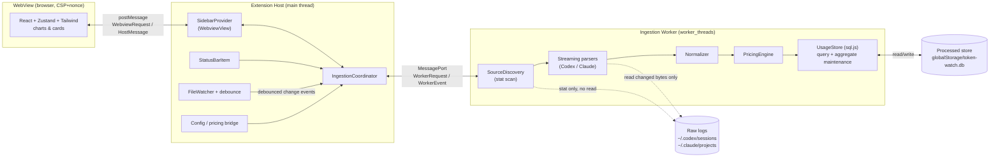
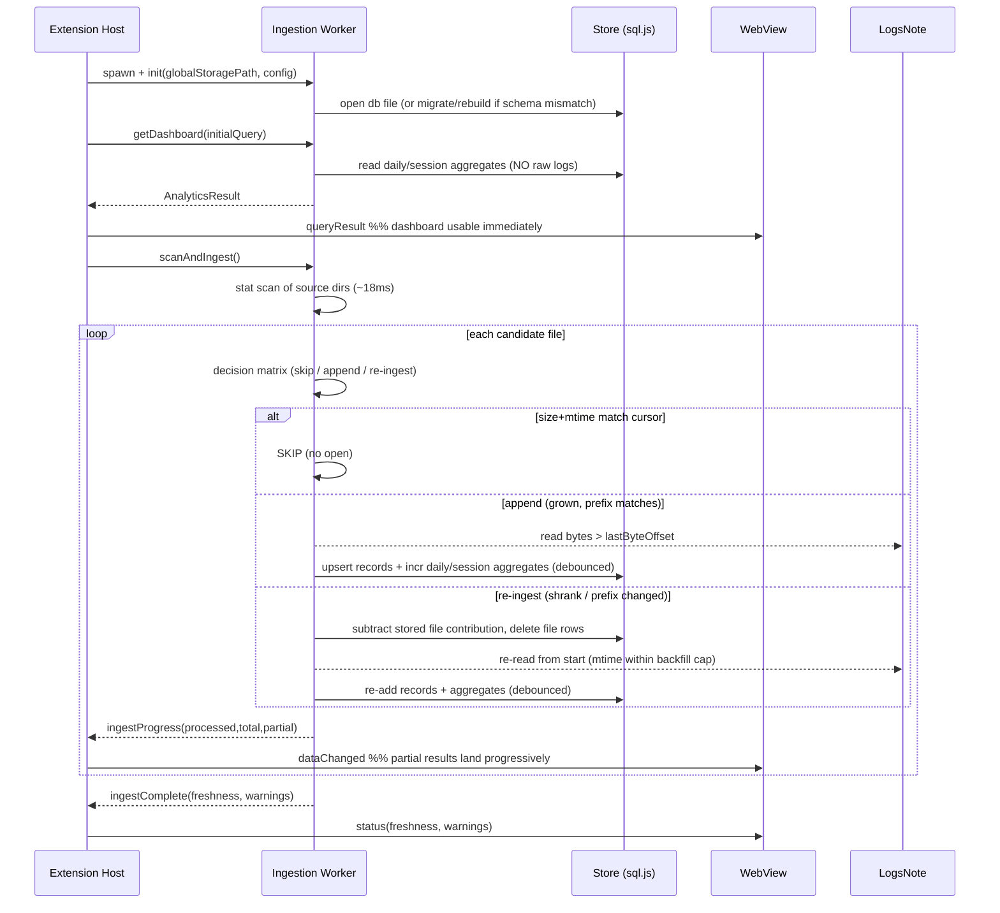

# Design Document: Token Tracking

## Overview

Token Watch ingests the session logs that **OpenAI Codex CLI** and **Anthropic
Claude Code** already write to disk, turns them into a unified, normalized usage
model, prices that usage in USD, and renders analytics inside the existing
sidebar WebView. This design builds **on top of the current scaffold** (esbuild
dual-bundle extension host + WebView, React + Zustand + Tailwind with the `tw-`
prefix, strict CSP/nonce `SidebarProvider`) — it does not replace it.

The single hardest constraint, and the one that shapes the entire architecture,
is **performance at real scale**. Measured on a real machine:

- Codex: ~3.0 GB across 332 files; largest single file ~760 MB with one ~22 MB
  line of embedded content.
- Claude: ~174 MB across 250 files.
- `stat`-ing all 582 files (size + mtime, no content read) takes **~18 ms**.

From those numbers the design commits to three non-negotiable rules:

1. **The dashboard never reads raw logs.** It reads only from a persistent
   processed store. Cold-start cost is independent of total log size.
2. **Activation never re-reads everything.** Every activation does the cheap
   full metadata scan (~tens of ms) and then opens *only* files whose
   `size`/`mtime` changed, append-parsing only the new bytes.
3. **Parsing happens off the extension-host main thread**, in a worker, with
   bounded memory (line-by-line streaming, giant lines skipped without
   buffering), progress reporting, and partial results.

Discovery is **mtime-driven**, never date-in-path driven, so a months-old
session reopened today is picked up. A 6-month backfill cap bounds *first-time*
content reads only — never ongoing updates.

The processed store is the source of truth for the UI. Daily aggregates feed
day/week/month series; finer analytics (session leaderboard, hour×day heatmap,
tool usage, context fill) query indexed record/session tables in the same store.
Pricing is a bundled-but-editable table; changing prices recomputes cost from
stored token aggregates **without re-ingesting raw logs**.

### Scope

In scope for v1: everything in Requirements 1–15 — Codex + Claude ingestion,
normalization, incremental store, day/week/month aggregation, USD cost,
model-variant analytics, sidebar dashboard, status bar, configuration, the full
analytics/insight chart set, tool/activity analytics, context-window/session
health, data-freshness/transparency indicators, and privacy guarantees.

Explicitly **out of scope** for v1 (per requirements): budget alerts and
CSV/JSON export.

---

## Architecture

The system has three isolated tiers connected by message passing:

- **Extension host (main thread)** — thin coordinator. Owns the
  `SidebarProvider` WebView, the status bar item, configuration, the file
  watcher, and the worker lifecycle. It does **no** heavy filesystem or parsing
  work; it routes messages and forwards aggregate results.
- **Ingestion worker (`worker_threads`)** — owns discovery (`stat` scan),
  per-source streaming parsers, the normalizer, the pricing engine, and the
  persistent store (sql.js). All raw-log reads and all SQL happen here.
- **WebView (browser context)** — React + Zustand + Tailwind dashboard. It only
  ever receives **aggregated** data over the message channel, never raw logs.



### Activation / ingestion data flow



### Why a worker thread (Requirement 4.16)

The largest file is 760 MB and worst-case backfill reads gigabytes. Doing that on
the extension host main path would freeze the UI and every other extension. The
worker isolates CPU + I/O, streams progress back, and lets the dashboard render
from the store immediately while backfill continues. The store (sql.js) lives
**inside the worker** so that both ingestion writes and analytics queries run off
the main thread; the host only ever holds small aggregate result objects.

### Bundling impact (new third esbuild target)

The current `esbuild.js` builds two bundles (extension host CJS, WebView IIFE).
This design adds a **third** bundle for the worker:

- `src/worker/ingestionWorker.ts` → `dist/ingestionWorker.js` (`platform: node`,
  `format: cjs`, `external: ["vscode"]` — the worker must **not** import
  `vscode`). The host spawns it with
  `new Worker(path.join(__dirname, "ingestionWorker.js"))`.
- sql.js ships a `sql-wasm.wasm` asset. The build copies it to
  `dist/sql-wasm.wasm` (same pattern as the existing `buildCss()` step), and the
  worker loads it via `initSqlJs({ locateFile: () => <abs path to dist wasm> })`.

These are the only build-pipeline changes; the WebView and host bundles keep
their existing configuration and conventions.

### Store engine decision (Requirement 4.1)

SQLite is the right data model (indexed range queries, incremental upserts,
composite-keyed aggregates). The open question is the **engine**, because a VS
Code extension host runs inside Electron's Node runtime and native modules must
match Electron's ABI:

| Option | Pros | Cons |
| --- | --- | --- |
| **`better-sqlite3`** (native) | Fastest; true incremental writes; rich SQL | Native addon must match the **Electron/Node ABI** of each VS Code release; needs per-platform/arch prebuilds; fragile across VS Code upgrades; complicates packaging |
| **`sql.js`** (WASM) | Zero native build; identical on every OS/arch; trivial to bundle | In-memory DB; persistence = export whole file; large DBs cost more per flush |
| Custom indexed JSON/NDJSON | No deps | We would reinvent indexing, transactions, query — high risk |

**Decision for v1: `sql.js` (WASM)**, behind a `UsageStore` interface. Rationale:
the store is *aggregate-dominated* and stays small (compact record columns +
daily/session aggregates), writes are coalesced/debounced and happen off-thread
in the worker, and WASM removes all native-ABI/packaging fragility — the single
biggest reliability risk for a published extension. The `UsageStore` interface
means that if profiling later shows full-file persistence is too costly, we can
swap in a `better-sqlite3` implementation **without touching parsing, normalizing,
pricing, or query code**. Persistence is via debounced `db.export()` to
`globalStorageUri/token-watch.db`, plus a flush on `deactivate()`.

### Charting decision (CSP-locked WebView)

The WebView CSP is `script-src 'nonce-...'` (no `eval`, no remote) and
`style-src 'unsafe-inline'`. The chart approach must therefore be **bundled** and
**eval-free**:

- **Recharts** for standard charts (stacked area/bar time series, scatter/bubble
  for the variant chart, donut for share-of-cost, line for burn-rate). It is
  React-native, renders **SVG** (no canvas/eval), is tree-shakeable, and themes
  cleanly via VS Code CSS variables (`var(--vscode-*)`). It is bundled into the
  existing `webview.js` IIFE and runs under the nonce CSP unchanged.
- **Hand-rolled SVG** for the hour-of-day × day-of-week heatmap (a 7×24 grid) —
  trivial to render directly and not worth a dependency.

Rationale: Recharts (and its `d3-scale`/`d3-shape` deps) contains no `eval`/`new
Function`, so the strict `script-src 'nonce-…'` policy is satisfied with the
existing bundle pipeline. Tradeoff: it adds bundle weight; if size becomes a
concern, `visx` (lower-level, same SVG/CSP profile) is a drop-in alternative for
the same chart set. We add Recharts as a WebView dependency; the host/worker tiers
gain no UI dependencies.

---

## Components and Interfaces

### Shared types (`src/shared/types.ts`)

A single module imported by host, worker, and WebView so the message protocol and
domain types stay in lockstep. It must not import `vscode`.

```typescript
export type Source = "codex" | "claude";

export type Effort =
  | "minimal" | "low" | "medium" | "high" | "xhigh" | "n/a";

/** The unified, normalized per-turn usage measurement (Req 3.1). */
export interface UsageRecord {
  source: Source;
  sessionId: string;
  /**
   * Idempotency / replacement key. Scoped per session (a requestId is only
   * promised unique within a contiguous group, not globally — Req 2.8):
   *   Claude:  `${source}:${sessionId}:${requestId}`  (fallback when no
   *            requestId: `${source}:${sessionId}:${uuid}`)
   *   Codex:   `${source}:${sessionId}:${lineByteOffset}` (each token_count line
   *            is a distinct turn; offset is stable within a file)
   * The store upserts (REPLACES) by this key, so a later streamed update for the
   * same request overwrites the earlier provisional row instead of adding to it.
   */
  dedupKey: string;
  timestamp: number;        // UTC epoch ms (Req 3.7)
  model: string;            // base model id, e.g. "gpt-5-codex", "claude-opus-4.7"
  effort?: Effort;          // Codex only; undefined/"n/a" for Claude (Req 3.6)
  variantId: string;        // `${model} (${effort})` or `${model}` when no effort (Req 7.1/7.2)
  workspace?: string;       // coarse workspace/repo identifier (Req 12.1)
  inputTokens: number;
  outputTokens: number;
  cacheReadTokens: number;
  cacheCreationTokens: number;
  reasoningTokens: number;
  /**
   * Per-turn structural metadata, carried ON the record (NOT in a session-keyed
   * map) so multi-turn sessions don't overwrite each other (Req 1.7, 2.7, 14).
   * Persisted into the matching columns of `usage_record`.
   */
  meta?: TurnMeta;
}

/** Documented total (Req 3.3). */
export function totalTokens(r: UsageRecord): number {
  return r.inputTokens + r.outputTokens + r.cacheReadTokens
       + r.cacheCreationTokens + r.reasoningTokens;
}

/** A tool invocation observed in a turn (Req 13). Counted independently of tokens. */
export interface ToolEvent {
  source: Source;
  sessionId: string;
  timestamp: number;        // UTC epoch ms
  toolName: string;         // e.g. "shell", "update_plan", "Read", "Edit"
  isSidechain: boolean;     // Claude sub-agent turn (Req 13.3)
  /**
   * Link back to the owning turn's `UsageRecord.dedupKey` so tool events are
   * (a) replaced together with the record on last-wins/resume, and (b) joinable
   * to the record's model/effort/workspace for filtered tool charts (Req 13.1).
   * `eventKey = `${recordDedupKey}#${toolIndexInTurn}`` is the unique per-event
   * id used for replace-by-record in the store.
   */
  recordDedupKey: string;
  eventKey: string;
}

/** Per-turn analytics extras, embedded on each UsageRecord.meta (Req 1.7, 2.7, 14). */
export interface TurnMeta {
  stopReason?: string;          // Claude (Req 13.4)
  isSidechain?: boolean;        // Claude (Req 13.3)
  contextWindow?: number;       // Codex info.model_context_window (Req 14.1)
  contextUsedTokens?: number;   // Codex last_token_usage.input_tokens = prompt context at this turn (Req 14.1)
  approvalPolicy?: string;      // Codex (Req 1.7)
  sandboxMode?: string;         // Codex (Req 1.7)
  entrypoint?: string;          // Claude (Req 2.7)
  version?: string;             // Claude version / Codex cli_version
  rateLimitPrimaryPct?: number;   // Codex rate_limits.primary.used_percent (Req 14.4, informational)
  rateLimitSecondaryPct?: number; // Codex rate_limits.secondary.used_percent (Req 14.4)
}

/**
 * Raw, per-turn output of a parser BEFORE token decomposition. The parser owns
 * log-structure concerns (which session/model/effort/workspace/timestamp a turn
 * belongs to, its dedupKey and structural meta) but emits the RAW token fields
 * exactly as they appear in the log. The Normalizer (and only the Normalizer)
 * performs the disjoint-bucket decomposition and returns a `UsageRecord`.
 * This resolves the parser↔normalizer contract: parsers produce RawTurn,
 * `normalize*` consumes RawTurn → UsageRecord (Req 3.4/3.5, Property 18).
 */
export interface RawTurnCommon {
  source: Source;
  sessionId: string;
  timestamp: number;       // UTC epoch ms
  model: string;
  effort?: Effort;
  workspace?: string;
  dedupKey: string;
  meta?: TurnMeta;
}
/** Codex raw token fields (OVERLAPPING: cached ⊆ input, reasoning ⊆ output). */
export interface RawCodexTurn extends RawTurnCommon {
  source: "codex";
  rawInputTokens: number;          // info.*.input_tokens
  rawCachedInputTokens: number;    // info.*.cached_input_tokens (subset of input)
  rawOutputTokens: number;         // info.*.output_tokens
  rawReasoningOutputTokens: number;// info.*.reasoning_output_tokens (subset of output)
  rawTotalTokens: number;          // info.*.total_tokens (== input + output)
}
/** Claude raw token fields (already DISJOINT buckets). */
export interface RawClaudeTurn extends RawTurnCommon {
  source: "claude";
  rawInputTokens: number;            // message.usage.input_tokens (excludes cache)
  rawOutputTokens: number;           // message.usage.output_tokens
  rawCacheReadTokens: number;        // cache_read_input_tokens
  rawCacheCreationTokens: number;    // cache_creation_input_tokens
}
export type RawTurn = RawCodexTurn | RawClaudeTurn;
```

### Variant identity (`src/shared/variant.ts`)

```typescript
export function makeVariantId(model: string, effort?: Effort): string {
  return effort && effort !== "n/a" ? `${model} (${effort})` : model;
}
export function baseModelOf(variantId: string): string {
  const m = variantId.match(/^(.*) \((minimal|low|medium|high|xhigh)\)$/);
  return m ? m[1] : variantId;
}
```

`makeVariantId`/`baseModelOf` are pure inverses for the labeled case and the
identity for the no-effort case — this is exercised by a round-trip property.

### Extension host components

#### `IngestionCoordinator` (`src/host/IngestionCoordinator.ts`)

Owns the worker, brokers all host↔worker traffic, and fans results out to the
WebView and status bar.

```typescript
export interface IngestionCoordinator {
  start(): Promise<void>;                       // spawn worker, init store
  getDashboard(q: AnalyticsQuery): Promise<AnalyticsResult>;
  query(q: AnalyticsQuery): Promise<AnalyticsResult>;
  scanAndIngest(reason: "activation" | "watch" | "manual"): void;  // fire-and-forget
  rescan(): void;                               // forced full re-ingest: sends scanAndIngest(reason:"manual", forceFull:true) (Req 15.4)
  updatePricing(table: PricingTable): Promise<void>; // recompute, no re-ingest (Req 6.6)
  onChanged: vscode.Event<FreshnessInfo>;       // fires when new data lands (Req 8.7, 9.3)
  dispose(): void;                              // flush + terminate worker
}
```

#### `SidebarProvider` (extends the existing one)

Keeps the existing strict CSP/nonce HTML and `localResourceRoots: [dist]`. Adds:
loads the WebView store on `ready`, relays `WebviewRequest` → coordinator, and
pushes `HostMessage` (query results, `dataChanged`, `ingestProgress`, `status`)
into the WebView. No CSP changes are required.

#### `StatusBarController` (`src/host/StatusBarController.ts`)

Creates a `StatusBarItem` showing today's tokens + USD (Req 9.1), command =
`token-watch.openPanel` (Req 9.2), refreshes on `coordinator.onChanged` within the
debounce interval (Req 9.3), and respects the `tokenWatch.statusBar.enabled`
setting (Req 9.4). To guarantee the item appears without the user first opening
the sidebar, the extension activates on `onStartupFinished` (see Manifest changes
below); on activation the controller reads today's totals cheaply from the store
(no raw-log read) and renders immediately, then live-updates via `onChanged`.

#### Manifest changes (`package.json`)

This feature requires three manifest edits to the existing scaffold:

1. **`activationEvents: ["onStartupFinished"]`** — replaces the empty array so the
   status bar renders and background ingestion starts shortly after startup,
   without blocking VS Code's launch (Req 9.1). The webview view and
   `token-watch.openPanel` command continue to contribute their own implicit
   activation.
2. **Commands** — add `token-watch.rescan` ("Token Watch: Rescan Logs", Req 15.4)
   alongside the existing `token-watch.openPanel`.
3. **Configuration** — replace the scaffold's single `tokenWatch.enabled` property
   with the authoritative settings block defined in Requirement 10's
   Configuration Schema table (per-source enable/path, pricing overrides,
   secondary currency + rate, ingestion debounce/maxLineBytes/backfillMonths,
   analytics anomalyMultiplier/contextFillWarnPct, statusBar.enabled). Keys MUST
   match that table verbatim; a typed `Config` accessor in
   `src/host/config.ts` reads them and validates ranges, applying defaults for
   out-of-range values.

#### `FileWatcher` (`src/host/FileWatcher.ts`)

Because the source dirs live **outside** the workspace (`~/.codex`, `~/.claude`),
`vscode.workspace.createFileSystemWatcher` is unreliable; this uses Node
`fs.watch` with `{ recursive: true }` where supported (macOS/Windows) and a
periodic `stat`-scan poll fallback (Linux). Events are debounced (default 2 s,
configurable — Req 4.21, 10.4) and coalesced into a single `scanAndIngest("watch")`.

### Ingestion worker components

#### `SourceDiscovery` (`src/worker/discovery.ts`)

```typescript
export interface CandidateFile {
  filePath: string;
  source: Source;
  size: number;
  mtimeMs: number;
  fileId: string;           // `${dev}:${ino}` (fallback `${birthtimeMs}:${path}`)
}

export interface SourceDiscovery {
  /** Cheap stat-only scan; NO content reads, NO date-in-path logic (Req 4.5, 1.2, 2.2). */
  scan(roots: SourceRoots): Promise<CandidateFile[]>;
}
```

Codex root walks `YYYY/MM/DD/rollout-*.jsonl`; Claude root walks
`projects/<encoded-cwd>/*.jsonl`. The `YYYY/MM/DD` structure is used only to
enumerate paths, **never** to judge freshness (freshness = mtime, Req 4.5/4.7).

#### Streaming parsers (`src/worker/parsers/`)

One parser per source, both implementing a common streaming contract that yields
small records and skips oversized lines without buffering.

```typescript
export interface ParseInput {
  filePath: string;
  startOffset: number;      // 0 for full read, lastByteOffset for append (Req 4.8)
  maxLineBytes: number;     // default 1 MB; skip larger lines unbuffered (Req 4.14)
  resumeState?: ResumeState; // running totals + recent requestIds (Req 4.11/4.12)
}

export interface ParseOutput {
  rawTurns: RawTurn[];      // RAW per-turn output; normalizer decomposes → UsageRecord
  toolEvents: ToolEvent[];
  endOffset: number;        // new lastByteOffset
  endState: ResumeState;    // new running totals + recent requestIds
  malformedCount: number;   // unparseable JSON lines skipped (Req 1.8, 15.3a)
  oversizedCount: number;   // lines skipped for exceeding maxLineBytes (Req 4.14, 15.3b)
  sessionMeta?: SessionMeta;
}

export interface SourceParser {
  parse(input: ParseInput, sink: (batch: ParseOutput) => void): Promise<void>;
}
```

- **`CodexParser`** — streams JSONL. Tracks the most recent `turn_context`
  (`payload.model`, `payload.effort`) and attributes each subsequent
  `token_count` record to it (Req 1.6). Prefers `info.last_token_usage`; when
  null, derives the delta by differencing `info.total_token_usage` against
  `resumeState.runningTotals[sessionId]` (Req 1.5, 4.11). Emits a `RawCodexTurn`
  with RAW Codex token fields to the normalizer, which decomposes the overlapping
  `cached_input_tokens` / `reasoning_output_tokens` into disjoint buckets
  (Req 3.4, Property 18) — the parser does NOT pre-sum them. Captures
  `function_call` tool names, `approval_policy`, `sandbox_policy.mode`, the
  `model_context_window`, and the per-turn context-used tokens
  (`last_token_usage.input_tokens`, the full prompt context at that turn — used
  for context-fill, never the cumulative total) (Req 1.7, 14.1). Fast prefix
  check (`"token_count"` / `"turn_context"` / `"session_meta"` substring) before
  `JSON.parse` (Req 4.15).
- **`ClaudeParser`** — streams JSONL. Emits a `RawClaudeTurn` for each `assistant`
  line with `message.usage` (Req 2.3), carrying the already-disjoint
  `cache_read_input_tokens` and `cache_creation_input_tokens` (Req 2.4). **Dedup
  semantics (Req 2.8, last-wins):** lines sharing a `requestId` are streamed
  cumulative updates; the parser keys each emitted raw turn by a session-scoped
  `dedupKey = ${source}:${sessionId}:${requestId}` (falling back to
  `${source}:${sessionId}:${uuid}` when `requestId` is absent), because a
  `requestId` is only promised unique within its contiguous group, not globally
  across sessions/files. It emits the record carrying the FINAL/maximum-cumulative
  `message.usage` for that request. Because the store upserts by `dedupKey` with
  replace semantics (subtract-old-then-add-new — see `UsageStore.applyFileResult`),
  a later update for the same request overwrites
  the earlier provisional value rather than inflating the aggregate. Across a
  resume boundary, `resumeState.recentRequestIds` lets the parser recognize a
  request whose group started in the already-parsed prefix and re-emit the
  replacement safely (Req 4.12). Ignores lines without `message.usage` (Req 2.5).
  Captures `stop_reason`, `isSidechain`, `tool_use` names, `entrypoint`,
  `version` into `meta` (Req 2.7). The Normalizer maps the raw turn directly
  (fields are already disjoint).

`ResumeState`:

```typescript
export interface CumulativeTotals {
  inputTokens: number; outputTokens: number; cacheReadTokens: number;
  cacheCreationTokens: number; reasoningTokens: number;
}
export interface ResumeState {
  runningTotals: Record<string /*sessionId*/, CumulativeTotals>; // Codex (Req 4.11)
  recentRequestIds: string[];                                     // Claude (Req 4.12)
}
```

#### `Normalizer` (`src/worker/normalizer.ts`)

Pure functions turning raw parsed shapes into `UsageRecord`s (Req 3). Sets absent
fields to 0/undefined rather than fabricating (Req 3.6), computes `variantId`
(Req 3.1), resolves the workspace (Claude: line-level `cwd`/`gitBranch`, else
decode project dir name — Req 2.6), and stores timestamps as UTC (Req 3.7).

**Disjoint-bucket decomposition (critical — Req 3.4/3.5).** The five normalized
token buckets (`inputTokens`, `outputTokens`, `cacheReadTokens`,
`cacheCreationTokens`, `reasoningTokens`) MUST be non-overlapping so `totalTokens`
never double counts. The two sources expose their fields differently:

- **Codex** fields OVERLAP (verified on real logs: `cached_input_tokens` ⊆
  `input_tokens`, `reasoning_output_tokens` ⊆ `output_tokens`, and
  `total_tokens == input_tokens + output_tokens`). The normalizer therefore
  SUBTRACTS the subsets out (all values clamped at ≥ 0):

  ```typescript
  // raw = Codex last_token_usage (a per-turn delta)
  const cacheReadTokens     = raw.cached_input_tokens;
  const inputTokens         = Math.max(0, raw.input_tokens  - raw.cached_input_tokens);
  const reasoningTokens     = raw.reasoning_output_tokens;
  const outputTokens        = Math.max(0, raw.output_tokens - raw.reasoning_output_tokens);
  const cacheCreationTokens = 0; // Codex has no separate cache-creation field
  // invariant: inputTokens + outputTokens + cacheReadTokens + reasoningTokens
  //            === raw.total_tokens   (asserted by Property 18)
  ```

- **Claude** `message.usage` fields are ALREADY disjoint (Anthropic's
  `input_tokens` excludes cached tokens), so they map directly:

  ```typescript
  const inputTokens         = u.input_tokens;
  const outputTokens        = u.output_tokens;
  const cacheReadTokens     = u.cache_read_input_tokens;
  const cacheCreationTokens = u.cache_creation_input_tokens;
  const reasoningTokens     = 0; // Claude exposes no separate reasoning-token field
  ```

```typescript
export function normalizeCodexTurn(raw: RawCodexTurn): UsageRecord;  // applies the subtraction above
export function normalizeClaudeTurn(raw: RawClaudeTurn): UsageRecord; // direct map
```

#### `PricingEngine` (`src/worker/pricing.ts`)

```typescript
export interface ModelRate {        // USD per 1K tokens, per type (Req 6.1, 6.2)
  inputPer1K?: number;
  cachedInputPer1K?: number;        // cache-read rate
  cacheCreationPer1K?: number;      // cache-write rate (Claude)
  outputPer1K?: number;             // reasoning tokens billed at this rate (documented)
}
export type PricingTable = Record<string /*model id*/, ModelRate>;

export interface CostBreakdown {
  usd: number;
  unknown: boolean;                 // model not in table (Req 6.3, 7.13)
}

export interface PricingEngine {
  costOfTokens(model: string, t: CumulativeTotals): CostBreakdown;
  costOfAggregate(model: string, agg: TokenSums): CostBreakdown;
  unmappedModels(seen: Set<string>): string[];   // for the indicator (Req 15.2)
}
```

Cost is a pure function of token sums + rates, so it is identical whether computed
per record at ingest time or recomputed later from stored aggregates (Req 6.6) —
this is asserted by a correctness property. Reasoning tokens are billed at the
model's output rate by default (documented assumption; reconciled against
`cost-history.json` for display only). Bundled defaults live in
`src/shared/defaultPricing.ts`; user overrides from configuration win (Req 6.4).

#### `UsageStore` (`src/worker/store/UsageStore.ts`)

The persistence + aggregate-maintenance + query boundary (engine-agnostic).

```typescript
export interface UsageStore {
  // lifecycle
  open(dbPath: string): Promise<void>;
  schemaVersion(): number;
  migrateOrRebuild(): Promise<"migrated" | "rebuilt" | "ok">;  // Req 4.3
  flush(): Promise<void>;          // debounced export to disk (Req 4.18)

  // cursors (Req 4.4)
  getCursor(filePath: string): FileCursor | undefined;
  putCursor(c: FileCursor): void;

  // ingestion (transactional, idempotent + replacement-safe via dedupKey)
  //
  // applyFileResult upserts each record BY dedupKey using replace semantics:
  //   - If no row exists for the dedupKey: INSERT the row and ADD its sums to the
  //     affected daily/session aggregates.
  //   - If a row already exists for the dedupKey (a streamed Claude update, a
  //     resumed append re-emitting the same request, or a duplicate line): first
  //     SUBTRACT the existing row's stored contribution from the aggregates, then
  //     overwrite the row, then ADD the new row's contribution.
  // This makes "last-wins" correct: replacing a provisional record never double
  // counts and never leaves stale aggregate residue (Req 2.8, 4.19). Pure
  // increment is used ONLY for genuinely new dedupKeys.
  applyFileResult(fileId: string, batch: StoreBatch): void;     // Req 2.8, 4.19
  subtractFileContribution(fileId: string): void;               // Req 4.10
  deleteFileRows(fileId: string): void;                         // Req 4.9

  // pricing recompute (no raw-log read) (Req 6.6)
  recomputeCosts(table: PricingTable): void;

  // queries (all read from the store, never raw logs) (Req 4.2, 4.20)
  dailySeries(q: AnalyticsQuery): DailyAggregate[];
  variantBreakdown(q: AnalyticsQuery): VariantMetrics[];
  sessionLeaderboard(q: AnalyticsQuery): SessionAggregate[];
  toolUsage(q: AnalyticsQuery): ToolUsageRow[];
  heatmap(q: AnalyticsQuery): HeatmapCell[];        // GROUP BY local dow,hour
  freshness(): FreshnessInfo;                       // Req 15.1
  warnings(): WarningInfo;                          // Req 15.2, 15.3
}
```

#### `AnalyticsService` (`src/worker/analytics.ts`)

Translates an `AnalyticsQuery` into store calls and derives computed metrics that
are not stored verbatim: week/month roll-ups from daily aggregates (Req 5.1,
4.20), burn-rate + projection (Req 11.4), cache efficiency + $ saved (Req 11.5/6,
7.8), reasoning intensity by effort (Req 11.7/8, 7.7), per-variant intensity
metrics (Req 7.4–7.9), anomaly flags vs trailing median (Req 11.15), and
Codex-vs-Claude comparison (Req 11.12). These are pure functions over stored rows.

### Message protocol

#### WebView ↔ Host (`src/shared/protocol.ts`)

```typescript
export interface AnalyticsQuery {
  view: "dashboard" | "series" | "variants" | "sessions" | "tools" | "heatmap" | "comparison";
  granularity: "day" | "week" | "month";
  range: { fromUtc: number; toUtc: number };   // inclusive (Req 5.5)
  sources?: Source[];                           // filters (Req 8.4, 11.18)
  models?: string[];
  efforts?: Effort[];
  workspaces?: string[];
  rollupToBaseModel?: boolean;                  // Req 7.3, 11.9
  breakdownByVariant?: boolean;                 // Req 11.3
}

export type WebviewRequest =
  | { type: "ready" }
  | { type: "query"; id: string; query: AnalyticsQuery }
  | { type: "rescan" }
  | { type: "updatePricing"; table: PricingTable }
  | { type: "openSetting"; key: string };

export type HostMessage =
  | { type: "queryResult"; id: string; result: AnalyticsResult }
  | { type: "dataChanged" }                                  // Req 8.7
  | { type: "ingestProgress"; processed: number; total: number; partial: boolean } // Req 4.17
  | { type: "status"; freshness: FreshnessInfo; warnings: WarningInfo;
      rateLimit?: RateLimitInfo; currency?: DisplayCurrencyConfig };           // Req 15, 14.4, 6.5
```

`AnalyticsResult` is a discriminated union keyed by `view`, each carrying only
aggregated arrays (never raw logs, Req 8.5). The WebView correlates responses by
`id`.

#### Host ↔ Worker (`src/shared/workerProtocol.ts`)

```typescript
export type WorkerRequest =
  | { type: "init"; dbPath: string; config: IngestConfig }
  | { type: "query"; id: string; query: AnalyticsQuery }
  | { type: "scanAndIngest"; reason: "activation" | "watch" | "manual"; forceFull?: boolean }
  | { type: "updatePricing"; table: PricingTable }
  | { type: "flush" };

export type WorkerEvent =
  | { type: "ready"; schema: "ok" | "migrated" | "rebuilt" }
  | { type: "queryResult"; id: string; result: AnalyticsResult }
  | { type: "progress"; processed: number; total: number; partial: boolean }
  | { type: "ingestComplete"; freshness: FreshnessInfo; warnings: WarningInfo }
  | { type: "error"; scope: string; message: string };
```

### WebView components

- **Store slices (`src/webview/store.ts`, Zustand)** — replaces the scaffold's
  counter store with: `filters` (granularity, range, sources, models, efforts,
  workspaces, rollup toggle), `data` (per-view `AnalyticsResult` cache keyed by
  request id), `status` (freshness, warnings, ingest progress), and actions
  (`setFilter`, `requestQuery`, `applyResult`, `rescan`, `savePricing`). Filter
  changes trigger a single batched re-query so every chart updates consistently
  (Req 8.4, 11.18).
- **Data hook (`src/webview/hooks/useQuery.ts`)** — issues a `query` request,
  resolves on the matching `queryResult` id, re-fetches on `dataChanged`.
- **Components** — `SummaryCards` (Req 8.2), `TimeSeriesChart` (stacked-by-type,
  variant breakdown — Req 11.1–3), `BurnRateCard` (Req 11.4), `CacheEfficiencyCard`
  (Req 11.5/6), `ReasoningOverheadChart` (Req 11.7/8), `VariantTable` (Req 7.4–7.13,
  sortable Req 7.10), `VariantBubbleChart` (Req 11.10), `EffortScalingChart`
  (Req 7.11/11.11), `ShareOfCostDonut` (Req 11.9), `SourceComparison` (Req 11.12),
  `WorkspaceBreakdown` (Req 11.13), `UsageHeatmap` (Req 11.14, hand-rolled SVG),
  `AnomalyBadges` (Req 11.15), `SessionLeaderboard` (Req 11.16), `ToolUsageChart`
  (Req 13), `SubAgentShare` (Req 13.3), `StopReasonChart` (Req 13.4),
  `ContextFillCard` (Req 14), `RateLimitIndicator` (Req 14.4),
  `FreshnessBar` (Req 15). Every chart renders an explicit empty state (Req 5.6,
  11.17). All layout uses the `tw-` prefix; colors use `var(--vscode-*)`.

---

## Data Models

### Persistent store (sql.js, file: `globalStorageUri/token-watch.db`)

All timestamps are stored as UTC epoch ms (source of truth); local-time fields
(`day`, `dow`, `hour`) are derived at **ingest** time using the host timezone so
day/week/month bucketing matches local time (Req 3.7, 5.2). A timezone change is
handled by the manual rescan (Req 15.4); this limitation is documented.

```sql
-- Schema/version + run metadata (Req 4.3, 15.1)
CREATE TABLE meta (
  key TEXT PRIMARY KEY,
  value TEXT
); -- rows: schema_version, last_ingest_run_utc, malformed_line_count,
   -- oversized_line_count,
   -- rate_limit_codex (JSON {primaryPct, secondaryPct, tsUtc} — latest seen, Req 14.4)

-- Normalized per-turn usage (Req 3, 4.1)
CREATE TABLE usage_record (
  dedup_key            TEXT PRIMARY KEY,  -- session-scoped idempotency/replacement key (Req 2.8): Claude `${source}:${sessionId}:${requestId|uuid}`, Codex `${source}:${sessionId}:${lineByteOffset}`
  file_id              TEXT NOT NULL,     -- for subtract/delete on re-ingest
  source               TEXT NOT NULL,
  session_id           TEXT NOT NULL,
  ts_utc               INTEGER NOT NULL,
  day_local            TEXT NOT NULL,     -- 'YYYY-MM-DD'
  dow_local            INTEGER NOT NULL,  -- 0..6
  hour_local           INTEGER NOT NULL,  -- 0..23
  model                TEXT NOT NULL,
  effort               TEXT NOT NULL,     -- 'n/a' when absent
  variant_id           TEXT NOT NULL,
  workspace            TEXT NOT NULL DEFAULT '',
  input_tokens         INTEGER NOT NULL DEFAULT 0,
  output_tokens        INTEGER NOT NULL DEFAULT 0,
  cache_read_tokens    INTEGER NOT NULL DEFAULT 0,
  cache_creation_tokens INTEGER NOT NULL DEFAULT 0,
  reasoning_tokens     INTEGER NOT NULL DEFAULT 0,
  total_tokens         INTEGER NOT NULL DEFAULT 0,
  context_window       INTEGER,           -- Codex info.model_context_window (Req 14.1)
  context_used_tokens  INTEGER,           -- Codex last_token_usage.input_tokens = full prompt context at this turn (Req 14.1)
  is_sidechain         INTEGER NOT NULL DEFAULT 0, -- Claude (Req 13.3)
  stop_reason          TEXT               -- Claude (Req 13.4)
);
CREATE INDEX idx_rec_ts       ON usage_record(ts_utc);
CREATE INDEX idx_rec_file     ON usage_record(file_id);
CREATE INDEX idx_rec_session  ON usage_record(source, session_id);
CREATE INDEX idx_rec_day      ON usage_record(day_local);

-- Tool invocations (Req 13)
CREATE TABLE tool_event (
  event_key   TEXT PRIMARY KEY,   -- `${record_dedup_key}#${toolIndexInTurn}` (replace-by-record)
  record_dedup_key TEXT NOT NULL, -- FK → usage_record.dedup_key; replaced/deleted with its record
  file_id     TEXT NOT NULL,
  source      TEXT NOT NULL,
  session_id  TEXT NOT NULL,
  ts_utc      INTEGER NOT NULL,
  day_local   TEXT NOT NULL,
  tool_name   TEXT NOT NULL,
  model       TEXT NOT NULL,      -- denormalized from owning record for filtered tool charts (Req 13.1)
  variant_id  TEXT NOT NULL,
  workspace   TEXT NOT NULL DEFAULT '',
  is_sidechain INTEGER NOT NULL DEFAULT 0
);
CREATE INDEX idx_tool_file   ON tool_event(file_id);
CREATE INDEX idx_tool_day    ON tool_event(day_local, source);
CREATE INDEX idx_tool_record ON tool_event(record_dedup_key);

-- Daily aggregate, keyed by day + source + variant + workspace (Req 4.19, 5.1)
CREATE TABLE daily_aggregate (
  day_local            TEXT NOT NULL,
  source               TEXT NOT NULL,
  variant_id           TEXT NOT NULL,
  base_model           TEXT NOT NULL,    -- for rollup (Req 7.3)
  workspace            TEXT NOT NULL DEFAULT '',
  input_tokens         INTEGER NOT NULL DEFAULT 0,
  output_tokens        INTEGER NOT NULL DEFAULT 0,
  cache_read_tokens    INTEGER NOT NULL DEFAULT 0,
  cache_creation_tokens INTEGER NOT NULL DEFAULT 0,
  reasoning_tokens     INTEGER NOT NULL DEFAULT 0,
  total_tokens         INTEGER NOT NULL DEFAULT 0,
  turns                INTEGER NOT NULL DEFAULT 0,
  cost_usd             REAL NOT NULL DEFAULT 0,   -- confirmed (mapped models)
  unknown_cost_turns   INTEGER NOT NULL DEFAULT 0,-- model had no price (Req 6.3)
  PRIMARY KEY (day_local, source, variant_id, workspace)
);
CREATE INDEX idx_daily_day ON daily_aggregate(day_local);

-- Session-level rollup for leaderboard / health (Req 11.16, 14.2)
CREATE TABLE session_aggregate (
  source         TEXT NOT NULL,
  session_id     TEXT NOT NULL,
  workspace      TEXT NOT NULL DEFAULT '',
  first_ts_utc   INTEGER NOT NULL,
  last_ts_utc    INTEGER NOT NULL,
  turns          INTEGER NOT NULL DEFAULT 0,
  total_tokens   INTEGER NOT NULL DEFAULT 0,
  cost_usd       REAL NOT NULL DEFAULT 0,
  peak_context_fill REAL,                 -- max over turns of (context_used_tokens / context_window) (Req 14.1/3)
  sidechain_tokens INTEGER NOT NULL DEFAULT 0, -- Req 13.3
  PRIMARY KEY (source, session_id)
);

-- Per-file cursor + its exact contribution for subtract-on-reingest (Req 4.4, 4.10)
CREATE TABLE file_cursor (
  file_path        TEXT PRIMARY KEY,
  file_id          TEXT NOT NULL,
  source           TEXT NOT NULL,
  size             INTEGER NOT NULL,
  mtime_ms         INTEGER NOT NULL,
  last_byte_offset INTEGER NOT NULL,
  head_hash        TEXT NOT NULL,  -- hash of first N bytes (rotation guard) (Req 4.9)
  tail_anchor_hash TEXT NOT NULL,  -- hash of the W bytes ending at last_byte_offset (append guard) (Req 4.8)
  running_totals   TEXT NOT NULL,  -- JSON: Record<sessionId, CumulativeTotals> (Req 4.11)
  recent_req_ids   TEXT NOT NULL,  -- JSON: string[] (Req 4.12)
  contribution     TEXT NOT NULL   -- JSON: per-(day,source,variant,workspace)+session deltas
);

-- Editable pricing (Req 6.4) and unmapped tracking (Req 15.2)
CREATE TABLE pricing (model TEXT PRIMARY KEY, rates_json TEXT NOT NULL);
CREATE TABLE unmapped_model (model TEXT PRIMARY KEY, first_seen_utc INTEGER NOT NULL);
```

### TypeScript row/value types

```typescript
export interface FileCursor {
  filePath: string;
  fileId: string;
  source: Source;
  size: number;
  mtimeMs: number;
  lastByteOffset: number;
  headHash: string;                // hash of first N bytes — rotation/rewrite guard (Req 4.9)
  tailAnchorHash: string;          // hash of the W bytes ending exactly at lastByteOffset — append guard (Req 4.8)
  runningTotals: Record<string, CumulativeTotals>;
  recentRequestIds: string[];
  contribution: FileContribution;
}

/** Exactly what this file added, so re-ingest can subtract it (Req 4.10). */
export interface FileContribution {
  daily: Array<{ day: string; source: Source; variantId: string; workspace: string;
                 sums: TokenSums; turns: number; costUsd: number; unknownTurns: number }>;
  sessions: Array<{ source: Source; sessionId: string; sums: TokenSums;
                    turns: number; costUsd: number;
                    firstTsUtc: number; lastTsUtc: number; sidechainTokens: number }>;
  recordKeys: string[];            // dedup_keys to delete
  toolEventCount: number;
}

export interface TokenSums {
  inputTokens: number; outputTokens: number; cacheReadTokens: number;
  cacheCreationTokens: number; reasoningTokens: number;
}

export interface DailyAggregate extends TokenSums {
  day: string; source: Source; variantId: string; baseModel: string;
  workspace: string; totalTokens: number; turns: number;
  costUsd: number; unknownCostTurns: number;
}

export interface VariantMetrics extends TokenSums {  // derived (Req 7.4–7.9)
  variantId: string; baseModel: string; effort: Effort; source: Source;
  totalTokens: number; costUsd: number; costUnknown: boolean;
  shareOfCostPct: number; shareOfTokensPct: number;
  turns: number; tokensPerTurn: number; costPerTurn: number;
  outputRatio: number;          // output / input (Req 7.6)
  reasoningIntensity: number;   // reasoning / output (Req 7.7)
  cacheEfficiencyPct: number;   // cacheRead / (cacheRead + non-cached input) (Req 7.8)
  blendedCostPer1K: number;     // cost / total * 1000 (Req 7.9)
}

export interface FreshnessInfo {
  latestRecordUtc?: number;     // Req 15.1
  lastIngestRunUtc?: number;    // Req 15.1
}
export interface WarningInfo {
  unmappedModels: string[];     // Req 15.2
  malformedLineCount: number;   // unparseable JSON lines skipped (Req 15.3a)
  oversizedLineCount: number;   // lines skipped over maxLineBytes (Req 15.3b)
}

export interface RateLimitInfo {      // latest Codex rate limits seen (Req 14.4, informational)
  primaryPct?: number;
  secondaryPct?: number;
  tsUtc?: number;
}

export interface DisplayCurrencyConfig {  // Req 6.5
  secondary?: string;           // ISO code, e.g. "JPY"; absent → USD only
  secondaryRate?: number;       // USD→secondary multiplier; must be > 0 to display
}
```

### Week / month derivation (Req 5.1, 4.20)

Week (ISO) and month rows are **never** stored; they are computed by grouping
`daily_aggregate` rows on a derived key (`isoWeekOf(day)` / `day.slice(0,7)`) and
summing token/cost columns. This keeps a single incremental write path (daily)
and makes "sum of daily over a range = direct aggregation of records" a checkable
invariant. The hour×day heatmap and tool/session/leaderboard views query the
indexed `usage_record`/`tool_event`/`session_aggregate` tables — still entirely
from the store, satisfying "no raw-log reads at query time" (Req 4.2/4.20).

---

## Ingestion & Incremental Update Design

### Activation flow (Req 4.2, 4.22)

1. Host spawns the worker and sends `init`. The worker opens the DB; if
   `meta.schema_version` differs from the code's version it migrates, or rebuilds
   from scratch (clears tables + cursors, forcing re-ingest) (Req 4.3).
2. Host immediately requests the dashboard query; the worker answers **from the
   store only** — no raw-log access — so the UI is usable at cold start
   regardless of log size (Req 4.2).
3. Host sends `scanAndIngest("activation")`. The worker always runs the cheap
   `stat` scan (~tens of ms) so reopened old sessions are caught even when the
   watcher never fired (Req 4.22).

### Metadata scan (Req 4.5)

`SourceDiscovery.scan` walks the source roots collecting `{filePath, size,
mtimeMs, fileId}` with `stat` only — no opens, no reads, and **no date-in-path
logic**. Freshness is judged solely by comparing `size`/`mtime` to the stored
cursor.

### Decision matrix (Req 4.6–4.10)

For each candidate file, compared against its stored `FileCursor`:

| Condition | Action |
| --- | --- |
| No cursor exists | **First ingest.** Honor backfill cap: read fully only if `mtime` within cap (Req 4.24); else defer (lazy/on-demand). |
| `size == cursor.size` **and** `mtime == cursor.mtime` | **Skip entirely** — no open, no read (Req 4.6). |
| `size >= cursor.lastByteOffset` **and** `headHash` unchanged **and** the `W` bytes ending at `cursor.lastByteOffset` still hash to `cursor.tailAnchorHash` | **Append.** Parse only bytes `> cursor.lastByteOffset`, resuming `ResumeState` from the cursor (Req 4.8, 4.11/4.12). |
| `size` decreased, **or** `headHash` changed, **or** the tail-anchor bytes no longer match `cursor.tailAnchorHash` | **Re-ingest.** `subtractFileContribution(fileId)` → `deleteFileRows(fileId)` → parse from offset 0 (Req 4.9, 4.10). Cap does **not** block this once the file is in the recent window (Req 4.25). |

**Append verification (two anchors, not one).** A leading-window check alone is
unsafe: a file could be rewritten while keeping its first line and growing in
size, which would be misclassified as an append and leave stale aggregates. The
decision therefore requires BOTH (a) the head bytes to be unchanged (cheap
rotation/replacement guard) AND (b) the `W`-byte window ending exactly at
`cursor.lastByteOffset` to still hash to `cursor.tailAnchorHash` — proving the
already-parsed region is byte-identical right up to the resume point. Only then is
the suffix treated as a pure append. To re-verify cheaply we read just the head
window plus the `W` bytes around `lastByteOffset` (a small, bounded read), never
the whole file. Any mismatch falls through to full re-ingest (subtract-then-reparse,
Req 4.9/4.10), which Property 8 guarantees leaves no residue.

### Resume correctness (Req 4.11, 4.12)

- **Codex**: deltas come from differencing cumulative `total_token_usage` per
  session. On append, the parser seeds `runningTotals[sessionId]` from the cursor,
  so the first new `token_count` differences against the correct prior cumulative
  value — no double counting, no negative deltas across the resume boundary.
- **Claude**: streamed updates share a `requestId`. The cursor retains a bounded
  set of `recentRequestIds` near the tail so dedup (Req 2.8) survives the resume
  boundary.

### Worker-thread strategy (Req 4.16, 4.17, 4.18)

Parsing/ingestion run in the worker. Records are flushed to the store in
**coalesced, debounced batches** (`applyFileResult` per file, wrapped in a single
transaction) rather than per record (Req 4.18). `progress` events stream
`{processed,total,partial}`; the host forwards `dataChanged` so the dashboard
updates with partial results as files complete (Req 4.17). DB persistence
(`db.export()` → disk) is itself debounced and also runs on `flush`/`deactivate`.

### Backfill bounding (Req 4.24–4.26)

The backfill cap (default 6 months, Req 10.5) bounds **first-time content reads
only**: on first sight, a file whose `mtime` is older than the cap is recorded as
a deferred cursor and not read until explicitly expanded. It never bounds updates
— if an old file's `mtime` later moves into the recent window (reopened session),
the decision matrix ingests it regardless of the cap (Req 4.25). When pending work
exceeds a configurable budget, the worker orders candidates **most-recent-mtime
first** and continues older ones in the background (Req 4.26).

### Watching & debounce (Req 4.21–4.23)

`FileWatcher` watches the source roots (recursive `fs.watch` where supported;
poll fallback elsewhere) and coalesces bursts within the debounce window (default
2 s) into one `scanAndIngest("watch")`. Where watching is disabled/unavailable,
the activation scan plus the manual rescan command cover freshness (Req 4.23,
15.4).

### Manual rescan = forced full re-ingest (Req 15.4)

The `token-watch.rescan` command calls `coordinator.rescan()`, which sends
`scanAndIngest({ reason: "manual", forceFull: true })`. With `forceFull`, the
worker treats EVERY discovered file as changed: for each file it runs
`subtractFileContribution(fileId)` → `deleteFileRows(fileId)` → parse from offset
0 → re-apply, and clears the backfill-cap deferral so the whole window is
rebuilt. This is the recovery path for a timezone change (local-day re-bucketing)
or any suspected drift, and it reuses the same subtract-then-reparse machinery as
a detected rewrite (Property 8 guarantees no residue).

### Pricing recompute path (Req 6.6)

`updatePricing` recomputes `daily_aggregate.cost_usd`,
`session_aggregate.cost_usd`, and `unknown_cost_turns` from **stored token sums**
and the new rates — it never reopens a raw log. Token columns are unchanged; only
cost columns are rewritten.

---

## Correctness Properties

*A property is a characteristic or behavior that should hold true across all valid
executions of a system — essentially, a formal statement about what the system
should do. Properties serve as the bridge between human-readable specifications and
machine-verifiable correctness guarantees.*

PBT applies strongly here: the parsers, normalizer, delta
differencing, pricing engine, and aggregate maintenance are pure, invariant-rich
functions over a large input space (JSONL streams, token sequences, rate tables).
Each property below is universally quantified and maps to the acceptance criteria
it validates. The set was de-duplicated during prework (e.g. per-field extraction
checks were folded into round-trip and aggregate-consistency properties; the
several "irrelevant line" cases were merged into one robustness property).

### Property 1: Parse and normalize round-trip per source

*For any* valid generated Codex or Claude session (a sequence of well-formed log
lines), parsing it and normalizing the result reproduces exactly the set of
`UsageRecord`s used to generate it (same per-turn token-type fields, model,
effort, timestamp, and `variantId`), with absent dimensions set to 0/undefined
rather than fabricated.

**Validates: Requirements 1.4, 1.6, 2.3, 2.4, 3.1, 3.6**

### Property 2: Variant id round-trip

*For any* base model id and effort, `baseModelOf(makeVariantId(model, effort))`
equals `model`, and the label includes the effort suffix if and only if an effort
dimension is present (Claude / "n/a" → bare base model).

**Validates: Requirements 3.1, 7.1, 7.2**

### Property 3: Total-token definition

*For any* `UsageRecord`, `totalTokens(r)` equals `inputTokens + outputTokens +
cacheReadTokens + cacheCreationTokens + reasoningTokens`.

**Validates: Requirements 3.3**

### Property 4: Delta differencing of cumulative totals

*For any* non-decreasing sequence of cumulative `total_token_usage` snapshots
within a session, the derived per-turn deltas are all non-negative and sum back to
the final cumulative value; this holds even when the sequence is split at an
arbitrary resume boundary with running totals restored from the cursor.

**Validates: Requirements 1.5, 4.11**

### Property 5: Robustness to malformed, oversized, and irrelevant lines

*For any* valid log stream, splicing in arbitrary malformed-JSON lines, lines
larger than the size cap, and irrelevant lines (Claude user/system/no-`usage`
lines) at arbitrary positions does not change the set of produced `UsageRecord`s,
and the two reported counters are exact: `malformedCount` equals the number of
spliced malformed-JSON lines, and `oversizedCount` equals the number of spliced
over-cap lines. Irrelevant (valid, non-usage) lines increment neither counter.

**Validates: Requirements 1.8, 2.5, 4.13, 4.14, 4.15, 15.3**

### Property 6: Append-parse equals full re-parse

*For any* log file expressible as `prefix + suffix`, ingesting `prefix` then
append-parsing `suffix` (resuming from the stored cursor) produces aggregates
identical to ingesting `prefix + suffix` in a single pass.

**Validates: Requirements 4.8, 4.11, 4.12**

### Property 7: Ingest idempotence and last-wins replacement

*For any* file content, ingesting the same bytes twice yields the same aggregates
as ingesting it once. Moreover, *for any* contiguous group of Claude lines sharing
a `requestId` (streamed cumulative updates in increasing order), ingesting the
whole group yields aggregates equal to ingesting only the final line of the group
— i.e. replacement by `dedupKey` subtracts the superseded contribution so no
intermediate update is double counted, and the owning turn's `tool_event` rows are
replaced (by `record_dedup_key`), not duplicated.

**Validates: Requirements 2.8, 4.9, 4.19, 13.1**

### Property 8: Subtract is the exact inverse of ingest

*For any* store state and any file, ingesting the file and then subtracting its
stored contribution returns every aggregate (daily, session, totals) to its exact
pre-ingest value; consequently a rewrite/rotation (subtract-then-reingest) equals
a fresh ingest of the new content with no residue.

**Validates: Requirements 4.9, 4.10**

### Property 9: Aggregate consistency across range and granularity

*For any* set of ingested records and any date range and granularity
(day/ISO-week/month), the totals derived from the stored daily aggregates equal
the totals computed by directly aggregating the underlying `usage_record`s over
the same range.

**Validates: Requirements 4.19, 4.20, 5.1, 5.5**

### Property 10: Cost correctness and recompute equality

*For any* token sums and pricing table, computed cost equals the sum over token
types of `(typeTokens / 1000) * typeRate` with cache tokens billed at the cache
rate; and the cost recomputed from stored aggregates for a given pricing table
equals the cost accumulated during ingestion under that same table.

**Validates: Requirements 6.1, 6.2, 6.6**

### Property 11: Unmapped models are excluded from confirmed cost but still counted

*For any* mix of records whose models are present or absent from the pricing
table, the confirmed USD total includes only mapped-model cost, every absent model
appears in the unmapped-models set, and token totals still include the unmapped
models' tokens.

**Validates: Requirements 6.3, 7.13, 15.2**

### Property 12: Variant rollup preserves totals

*For any* set of variant-level aggregates, summing them, rolling them up to base
model, and rolling them up to source all yield the same grand totals for every
token type and for cost.

**Validates: Requirements 7.3**

### Property 13: Variant metrics equal their definitions and shares are consistent

*For any* set of variant aggregates, each derived metric equals its formula
(output ratio = output/input, reasoning intensity = reasoning/output, cache
efficiency = cacheRead/(cacheRead + non-cached input), blended cost-per-1K =
cost/total*1000, tokens-per-turn, cost-per-turn), and `shareOfCostPct` across all
variants sums to approximately 100% whenever total cost is positive.

**Validates: Requirements 7.4, 7.5, 7.6, 7.7, 7.8, 7.9, 11.5**

### Property 14: Cache savings sign and bound

*For any* token sums and a pricing table where the cache-read rate is below the
input rate, estimated USD saved by caching equals `cacheRead/1000 * (inputRate -
cacheReadRate)` and is non-negative, and cache efficiency lies in [0, 1].

**Validates: Requirements 11.5, 11.6**

### Property 15: Anomaly flags match the threshold definition

*For any* daily-cost series and multiplier `k`, the days flagged as anomalies are
exactly those whose cost exceeds `k * median(trailing window)`.

**Validates: Requirements 11.15**

### Property 16: Partition invariants (sidechain / tools / context)

*For any* generated set of turns: sidechain tokens plus main tokens equal total
tokens; per-tool call counts equal the number of generated tool blocks of each
name and tool shares sum to ~100%; and per-session peak context fill equals the
maximum over turns of `contextUsedTokens / contextWindow` (using the turn's full
prompt context, never the cumulative session total).

**Validates: Requirements 13.1, 13.2, 13.3, 14.1, 14.3**

### Property 17: No prompt or completion content ever leaves the parser

*For any* generated log containing a unique sentinel string embedded in prompt /
`text` / `content` / reasoning fields, that sentinel never appears in any produced
`UsageRecord`, any persisted store row, or any message emitted to the WebView.

**Validates: Requirements 12.1**

### Property 18: Codex token decomposition is loss-less and disjoint

*For any* Codex `token_count` usage with `cached_input_tokens ≤ input_tokens` and
`reasoning_output_tokens ≤ output_tokens`, the normalized buckets are disjoint and
preserve the raw total: `cacheReadTokens = cached_input_tokens`,
`inputTokens = input_tokens − cached_input_tokens`,
`reasoningTokens = reasoning_output_tokens`,
`outputTokens = output_tokens − reasoning_output_tokens`,
`cacheCreationTokens = 0`, every bucket is ≥ 0, and
`inputTokens + outputTokens + cacheReadTokens + reasoningTokens` equals the raw
`total_tokens`. For Claude, the direct-mapped buckets are likewise non-negative
and never double count (cached tokens are not included in `input_tokens`). This
guards against the double-counting trap where raw overlapping fields are summed.

**Validates: Requirements 3.3, 3.4, 3.5**

---

## Error Handling

The guiding rule (Req 1.8, 12.4, 15.3) is **degrade, never crash**: a bad line, a
bad file, or a bad source must not abort ingestion of the rest.

| Failure | Handling |
| --- | --- |
| **Malformed JSON line** | Skip the line, increment `parse_warning_count`, continue. Surfaced as a non-blocking count in the freshness bar (Req 1.8, 15.3). |
| **Oversized line (> cap)** | Detected by the streaming reader before materializing the line; skipped without buffering its content (Req 4.14). Counted as a warning. |
| **Permission denied on a source dir** | Catch `EACCES`/`EPERM` during scan; emit a clear `error` event for that source, continue with the other source (Req 12.4). UI shows a per-source warning. |
| **Missing source dir** | Treated as "no data for that source" (empty state), not an error (Req 5.6, 1.1/2.1 overridable paths). |
| **Corrupt store / failed open** | `migrateOrRebuild` catches read/parse failure, backs up the corrupt file, rebuilds an empty schema, clears cursors so a full re-ingest repopulates it (Req 4.3). |
| **Schema version mismatch** | Run forward migrations if available; otherwise rebuild (same path as corruption) (Req 4.3). |
| **Partial backfill interruption** (worker crash / window close mid-ingest) | Cursors are written per completed file inside the same transaction as that file's aggregates, so a restart resumes from the last fully-ingested file with no double counting (ties to Property 6/8). |
| **Worker crash** | Host detects `exit`/`error`, surfaces a status error, and offers manual rescan; the dashboard still serves the last persisted store. |
| **File disappears between scan and read** | Treated as a removed file: skip; its prior contribution remains until a rescan reconciles (documented best-effort). |
| **Unmapped model** | Not an error: cost marked unknown, tokens still counted, model surfaced (Req 6.3, 15.2). |

Worker errors are reported as structured `WorkerEvent` `{ type: "error", scope,
message }` and never include raw-log content.

---

## Testing Strategy

A dual approach: **property-based tests** for the universal invariants above and
**example/integration tests** for wiring, UI, and configuration.

### Tooling

- **`fast-check`** (added as a devDependency) for property tests, run under the
  existing Mocha setup. Property tests live in `src/test/properties/*.test.ts`,
  compiled by `npm run compile-tests` to `out/`, and discovered by the existing
  `.vscode-test.mjs` glob (`out/test/**/*.test.js`). Pure-logic property tests do
  not require the VS Code host and can also run via a plain `mocha`/`node` task,
  but reusing the existing runner keeps one path.
- **`@vscode/test-cli` / `@vscode/test-electron`** (already present) for
  integration tests in the extension host (command registration, status bar,
  configuration application, CSP presence, query-returns-aggregates-only).

### Property test configuration

- Each correctness property is implemented by a **single** `fast-check` property
  with **`numRuns: 100`** minimum.
- Each test is tagged with a comment in the format:
  `// Feature: token-tracking, Property {n}: {property text}`.
- Custom **arbitraries** mirror the verified log shapes:
  `arbCodexSession` (session_meta → interleaved turn_context / token_count with
  monotonic `total_token_usage`, optional null `last_token_usage`, function_call
  lines), and `arbClaudeSession` (assistant lines with `message.usage`, repeated
  `requestId`s, `isSidechain`, interspersed user/system/no-usage lines). Generators
  also emit sentinel-bearing content fields (for Property 17), malformed lines, and
  oversized lines (for Property 5).

### Unit (example) tests

Focused, concrete cases that complement the properties: the decision matrix
(skip/append/re-ingest) using temp files and asserting **no `fs.open`** on a
matching cursor (Req 4.6); a **real-fixture decomposition case** asserting that a
known Codex `token_count` line (e.g. `input=22291, output=772, cached=…,
reasoning=…`, `total_tokens=23063`) normalizes to disjoint buckets whose sum
equals the raw `total_tokens` and does NOT double count cached/reasoning (Req 3.4,
Property 18); metric ranking order (Req 7.10); empty-state results (Req 5.6,
11.17); workspace decoding from Claude project dir names (Req 2.6); the bundled
default pricing table loads and validates.

### Integration tests (`@vscode/test-cli`)

- Extension activates; `token-watch.openPanel` registered; status bar item present
  and clicking opens the view (Req 8, 9).
- Configuration overrides (custom paths, disabled source, pricing override, watch
  debounce, thresholds) take effect without restart (Req 10).
- The `SidebarProvider` HTML contains the strict CSP with a nonce and no remote
  `script-src` (Req 8.6).
- **Dashboard-from-store regression** (Req 4.2): point the extension at a populated
  store and a spy-wrapped `fs`; load every dashboard view and assert **zero raw-log
  file opens** at query time. This doubles as the performance regression guard.
- **Aggregated-payload check** (Req 8.5, 12.1): capture emitted `HostMessage`s and
  assert payloads carry only aggregate shapes and contain no content/sentinel
  fields.

### Fixtures

Small fixtures derived from the **real** log shapes (a handful of Codex
`rollout-*.jsonl` and Claude `<sessionId>.jsonl` excerpts, content-scrubbed) live
under `src/test/fixtures/` and back both example and integration tests, ensuring
the parsers track reality, not assumptions.

### PBT scope note

PBT is applied only to the pure logic tiers (parsers, normalizer, delta
differencing, pricing, aggregation, analytics math). The WebView rendering, status
bar, file watching, and worker plumbing are verified with example/integration
tests, since their behavior does not vary meaningfully with randomized input.

---

## Security & Privacy

The extension is read-only with respect to agent data and stays local by default.

- **Minimal extraction (Req 12.1).** Parsers read only token counts, timestamps,
  model, effort, coarse workspace/repo identifiers, tool names, and structural
  flags (`stop_reason`, `isSidechain`, context window, rate-limit percentages).
  Prompt text, completion text, reasoning content, and `function_call` arguments
  are **never** extracted or stored. Property 17 enforces this with a sentinel test
  across records, store rows, and emitted messages.
- **Local-only storage (Req 12.2).** Aggregates and cursors live solely in the
  extension's `globalStorageUri` (`token-watch.db`). Nothing is written to synced
  settings or any remote location.
- **No network by default (Req 12.3).** v1 ships a bundled pricing table and does
  no outbound requests. Any future pricing refresh must be explicit opt-in and send
  **no** usage data.
- **Strict WebView CSP (Req 8.6).** The existing `SidebarProvider` CSP is retained
  unchanged: `default-src 'none'; style-src ${cspSource} 'unsafe-inline';
  script-src 'nonce-${nonce}'; img-src ${cspSource} https: data:`, with
  `localResourceRoots` limited to `dist`. The chosen chart library (Recharts) is
  bundled and `eval`-free, so it runs under this policy without relaxation. The
  WebView only ever receives aggregated data, never raw logs (Req 8.5).
- **Permission resilience (Req 12.4).** Unreadable source directories produce a
  clear per-source warning and the extension continues with whatever sources are
  available.
- **Read-only guarantee.** No code path opens agent log files for writing; the only
  file the extension writes is its own store.
