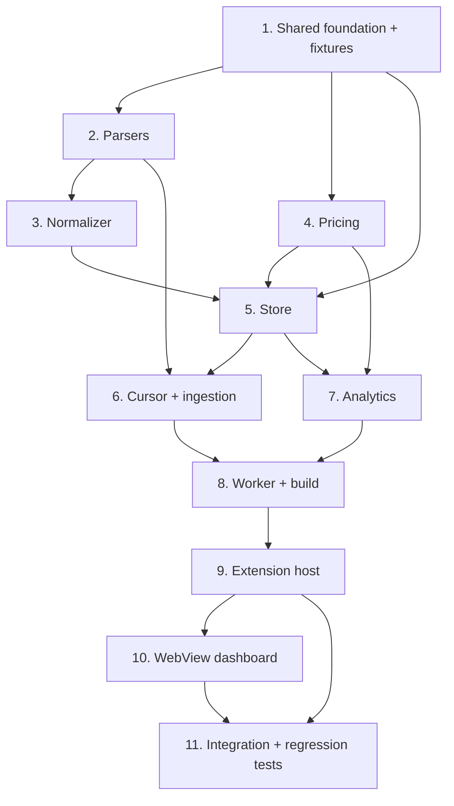

# Implementation Plan

## Overview

Coding tasks only. Each builds on the previous and ends in a verifiable state.
Pure, property-rich logic is built and tested first, then worker plumbing, then
the extension host, then the WebView, then end-to-end integration tests.

Contract note (parser ↔ normalizer): parsers emit RAW per-turn shapes
(`RawCodexTurn` / `RawClaudeTurn`) and the Normalizer alone decomposes tokens into
the disjoint `UsageRecord` buckets. `ParseOutput.rawTurns` is therefore
`RawTurn[]`, not `UsageRecord[]`.

Test tooling note: `fast-check` is a devDependency (added in task 1.0) for
property tests; each property test is tagged
`// Feature: token-tracking, Property {n}: {text}` with `numRuns >= 100`. Property
tests live in `src/test/properties/*.test.ts` and compile to `out/` via the
existing `npm run compile-tests` + `.vscode-test.mjs`.

## Task Dependency Graph

```json
{
  "waves": [
    { "wave": 1, "tasks": ["1.0", "1.1", "1.2", "1.6"], "dependsOn": [] },
    { "wave": 2, "tasks": ["1.3", "1.4", "1.5", "2.1", "4.1"], "dependsOn": ["1.0", "1.1", "1.2"] },
    { "wave": 3, "tasks": ["2.2", "4.2"], "dependsOn": ["2.1", "4.1"] },
    { "wave": 4, "tasks": ["2.3", "2.4"], "dependsOn": ["2.1", "2.2"] },
    { "wave": 5, "tasks": ["2.5", "3.1"], "dependsOn": ["2.3", "2.4", "1.5"] },
    { "wave": 6, "tasks": ["3.2", "3.3", "5.1"], "dependsOn": ["3.1", "1.5", "1.6"] },
    { "wave": 7, "tasks": ["5.2", "5.3"], "dependsOn": ["5.1", "1.5", "3.1", "4.1"] },
    { "wave": 8, "tasks": ["5.4", "6.1", "6.2", "7.1"], "dependsOn": ["5.2", "5.3"] },
    { "wave": 9, "tasks": ["6.3", "7.2"], "dependsOn": ["6.1", "6.2", "5.2", "7.1"] },
    { "wave": 10, "tasks": ["6.4", "8.1"], "dependsOn": ["6.3", "7.1"] },
    { "wave": 11, "tasks": ["8.2", "8.3", "8.4"], "dependsOn": ["8.1"] },
    { "wave": 12, "tasks": ["8.5"], "dependsOn": ["8.2", "8.3", "8.4"] },
    { "wave": 13, "tasks": ["9.1", "9.2"], "dependsOn": ["8.5"] },
    { "wave": 14, "tasks": ["9.3", "9.4", "9.5"], "dependsOn": ["9.1", "9.2"] },
    { "wave": 15, "tasks": ["9.6"], "dependsOn": ["9.3", "9.4", "9.5"] },
    { "wave": 16, "tasks": ["10.1", "10.2"], "dependsOn": ["9.6"] },
    { "wave": 17, "tasks": ["10.3", "10.4", "10.5", "10.6", "10.7", "10.8", "10.9", "10.10"], "dependsOn": ["10.1", "10.2"] },
    { "wave": 18, "tasks": ["10.11"], "dependsOn": ["10.3", "10.4", "10.5", "10.6", "10.7", "10.8", "10.9", "10.10"] },
    { "wave": 19, "tasks": ["11.1", "11.2", "11.3", "11.4"], "dependsOn": ["9.6", "10.11"] }
  ]
}
```



## Tasks

## 1. Shared foundation (deps, types, variant, protocols, store types, fixtures)

- [x] 1.0 Add test dependency `fast-check` to `devDependencies` and verify the
  test toolchain compiles.
  - Run `npm install`, add an empty `src/test/properties/` dir, and confirm
    `npm run compile-tests` succeeds with the new dep resolvable.
  - _Requirements: (tooling for all property tests)_

- [x] 1.1 Create `src/shared/types.ts` (must NOT import `vscode`)
  - Define `Source`, `Effort`, `CumulativeTotals`, `TokenSums`, `TurnMeta` (incl.
    `rateLimitPrimaryPct`/`rateLimitSecondaryPct`), `UsageRecord` (with `dedupKey`
    and embedded `meta?: TurnMeta`), `ToolEvent` (with `recordDedupKey` +
    `eventKey` linking to the owning turn), `totalTokens(r)` helper, and the RAW
    parser shapes `RawTurnCommon`, `RawCodexTurn`, `RawClaudeTurn`, `RawTurn`.
  - _Requirements: 3.1, 3.3, 1.7, 2.7, 13.1, 14.1, 14.4_

- [x] 1.2 Create `src/shared/variant.ts` with `makeVariantId(model, effort)` and
  `baseModelOf(variantId)`.
  - _Requirements: 3.1, 7.1, 7.2_

- [x] 1.3 Write property tests for the total definition and variant round-trip.
  - Property 3: `totalTokens` equals the sum of the five disjoint buckets.
  - Property 2: `baseModelOf(makeVariantId(m,e)) === m`; suffix present iff effort.
  - _Design: Property 2, 3_ · _Requirements: 3.1, 3.3, 7.1, 7.2_

- [x] 1.4 Create `src/shared/protocol.ts` (WebView↔host) and
  `src/shared/workerProtocol.ts` (host↔worker) with `AnalyticsQuery`,
  `AnalyticsResult` (discriminated by `view`), `WebviewRequest`, `HostMessage`,
  `WorkerRequest`, `WorkerEvent`, `FreshnessInfo`, `WarningInfo` (incl.
  `malformedLineCount` + `oversizedLineCount`), `RateLimitInfo`
  (`{primaryPct?, secondaryPct?, tsUtc?}`), and `DisplayCurrencyConfig`
  (`{secondary?: string; secondaryRate?: number}`).
  - The `status` `HostMessage` carries `freshness`, `warnings`, `rateLimit`
    (`RateLimitInfo`), and `currency` (`DisplayCurrencyConfig`) so the WebView can
    render the rate-limit indicator and format all costs in the secondary
    currency without extra round-trips.
  - _Requirements: 8.4, 8.5, 8.7, 4.17, 6.5, 14.4, 15.1, 15.2, 15.3_

- [x] 1.5 Create `src/shared/storeTypes.ts`: the persistence/row/value types shared
  by store, analytics, and protocols — `FileCursor`
  (`{filePath, fileId, source, size, mtimeMs, lastByteOffset, headHash,
  tailAnchorHash, runningTotals, recentRequestIds, contribution}`),
  `FileContribution`, `StoreBatch`, `DailyAggregate`, `SessionAggregate`,
  `VariantMetrics`, `HeatmapCell`, `ToolUsageRow`. This exists BEFORE the store so
  task 5.2 needs no temporary/duplicate types.
  - _Requirements: 4.4, 4.19, 5.1, 7.4_

- [ ] 1.6 Add content-scrubbed fixtures under `src/test/fixtures/` derived from
  real Codex `rollout-*.jsonl` and Claude `<sessionId>.jsonl` shapes (small
  excerpts, no prompt/content), including one Codex `token_count` line with a
  known `total_tokens` for the decomposition example.
  - _Requirements: 1.4, 2.3_

## 2. Streaming parsers (Codex + Claude)

- [ ] 2.1 Define the streaming parse contract in `src/worker/parsers/types.ts`:
  `ParseInput` (filePath, startOffset, maxLineBytes, resumeState), `ParseOutput`
  (`rawTurns: RawTurn[]`, `toolEvents`, `endOffset`, `endState`, `malformedCount`,
  `oversizedCount`, `sessionMeta`), `ResumeState`, `SourceParser`, `SessionMeta`.
  - _Requirements: 4.8, 4.11, 4.12, 4.13, 4.14, 4.15, 15.3_

- [ ] 2.2 Implement a bounded-memory line reader: stream a byte range
  line-by-line from `startOffset`, skip any line longer than `maxLineBytes`
  without buffering it, and do a fast substring/prefix check before `JSON.parse`.
  - _Requirements: 4.13, 4.14, 4.15_

- [ ] 2.3 Implement `CodexParser` (`src/worker/parsers/codex.ts`) emitting
  `RawCodexTurn`s:
  - Track most recent `turn_context` (`model`, `effort`, `approval_policy`,
    `sandbox_policy.mode`) and attribute following `token_count` records to it.
  - Prefer `info.last_token_usage`; when null, derive deltas by differencing
    `info.total_token_usage` against `resumeState.runningTotals[sessionId]`.
  - Emit RAW token fields (do NOT pre-sum); put `model_context_window`,
    `last_token_usage.input_tokens` (context-used), and
    `rate_limits.primary/secondary.used_percent` into `meta`. Build Codex
    `dedupKey` = `source:sessionId:lineByteOffset` (of the `token_count` line).
  - Tool attribution: `function_call` lines appear BEFORE their turn's
    `token_count`. Buffer pending `function_call` tool names for the current turn;
    when the next `token_count` line is reached, emit the buffered names as
    `ToolEvent`s using THAT token_count's `dedupKey` as `recordDedupKey`
    (`eventKey = ${recordDedupKey}#${index}`), then clear the buffer. Any unflushed
    buffer at end-of-file/turn boundary is discarded.
  - _Requirements: 1.3, 1.4, 1.5, 1.6, 1.7, 1.8, 13.1, 14.4_

- [ ] 2.4 Implement `ClaudeParser` (`src/worker/parsers/claude.ts`) emitting
  `RawClaudeTurn`s:
  - Emit a raw turn per `assistant` line with `message.usage`; ignore lines with
    no `message.usage`.
  - Session-scoped `dedupKey` = `source:sessionId:requestId` (fallback
    `…:uuid`); for a contiguous repeated-`requestId` group, emit the FINAL
    (max-cumulative) usage (last-wins) and carry recent ids in `endState`.
  - Capture `stop_reason`, `isSidechain`, `tool_use` names, `entrypoint`,
    `version` into `meta`; emit `tool_use` blocks as `ToolEvent`s with
    `recordDedupKey` + `eventKey`; resolve workspace from line `cwd`/`gitBranch`.
  - _Requirements: 2.3, 2.4, 2.5, 2.6, 2.7, 2.8, 4.12, 13.1_

- [ ] 2.5 Write parser robustness property test with arbitraries mirroring real
  log shapes (monotonic cumulative totals, null `last_token_usage`, repeated
  requestIds, sidechain turns, malformed/oversized/irrelevant lines).
  - Property 5: malformed/oversized/irrelevant lines don't change emitted raw
    turns; `malformedCount` equals the number of malformed-JSON lines and
    `oversizedCount` equals the number of over-cap lines (two distinct counters);
    valid irrelevant lines increment neither.
  - _Design: Property 5_ · _Requirements: 1.8, 2.5, 4.13, 4.14, 4.15, 15.3_

## 3. Normalizer (disjoint-bucket decomposition)

- [ ] 3.1 Implement `src/worker/normalizer.ts` (`RawTurn` → `UsageRecord`):
  - `normalizeCodexTurn(raw: RawCodexTurn)`: `cacheReadTokens=cached_input_tokens`,
    `inputTokens=input_tokens−cached_input_tokens`,
    `reasoningTokens=reasoning_output_tokens`,
    `outputTokens=output_tokens−reasoning_output_tokens`,
    `cacheCreationTokens=0`, all clamped `>= 0`.
  - `normalizeClaudeTurn(raw: RawClaudeTurn)`: direct map; `reasoningTokens=0`.
  - Set absent fields to 0/undefined; compute `variantId`; keep UTC timestamps and
    carry through `meta`/`workspace`/`dedupKey`.
  - _Requirements: 3.1, 3.2, 3.4, 3.5, 3.6, 3.7, 2.6_

- [ ] 3.2 Write the decomposition property + real-fixture example test (uses 1.6).
  - Property 18: Codex buckets are disjoint, non-negative, and their sum equals
    raw `total_tokens`; Claude direct-mapped buckets are non-negative and don't
    double count.
  - Example: the real Codex fixture `token_count` line normalizes so the bucket
    sum equals its raw `total_tokens` with no double counting.
  - _Design: Property 18_ · _Requirements: 3.3, 3.4, 3.5_

- [ ] 3.3 Write the parse+normalize round-trip property test (parsers + normalizer).
  - Property 1: for any generated session, parse→normalize reproduces exactly the
    `UsageRecord`s used to generate it, with absent dimensions 0/undefined.
  - _Design: Property 1_ · _Requirements: 1.4, 1.6, 2.3, 2.4, 3.1, 3.6_

## 4. Pricing engine

- [ ] 4.1 Create `src/shared/defaultPricing.ts` (bundled editable defaults) and
  `src/worker/pricing.ts` with `ModelRate`, `PricingTable`, `CostBreakdown`,
  `PricingEngine.costOfTokens/costOfAggregate/unmappedModels`.
  - Apply per-type rates (input, cache-read, cache-creation, output; reasoning at
    output rate, documented); unmapped model → `unknown` + surfaced.
  - _Requirements: 6.1, 6.2, 6.3, 6.4, 7.13, 15.2_

- [ ] 4.2 Write pricing property tests.
  - Property 10: cost equals Σ over types of `(typeTokens/1000)*typeRate`.
  - Property 11: unmapped models excluded from confirmed cost but tokens still
    counted; absent models appear in the unmapped set.
  - Property 14: cache savings = `cacheRead/1000*(inputRate−cacheReadRate)`,
    non-negative; cache efficiency in [0,1].
  - _Design: Property 10, 11, 14_ · _Requirements: 6.1, 6.2, 6.3, 11.5, 11.6, 15.2_

## 5. Persistent store (sql.js) with replace/subtract semantics

- [ ] 5.1 Add `sql.js` dependency; create `src/worker/store/schema.sql` (or inline
  DDL) for all tables + indices. Spell out the recovery-critical columns so they
  are not left to guesswork:
  - `usage_record`: `dedup_key` TEXT PRIMARY KEY, `file_id`, `source`,
    `session_id`, `ts_utc`, `day_local`, `dow_local`, `hour_local`, `model`,
    `effort`, `variant_id`, `workspace`, `input_tokens`, `output_tokens`,
    `cache_read_tokens`, `cache_creation_tokens`, `reasoning_tokens`,
    `total_tokens`, `context_window`, `context_used_tokens`, `is_sidechain`,
    `stop_reason`.
  - `tool_event`: `event_key` TEXT PRIMARY KEY (`${record_dedup_key}#${index}`),
    `record_dedup_key` (FK → usage_record, replaced/deleted with its record),
    `file_id`, `source`, `session_id`, `ts_utc`, `day_local`, `tool_name`,
    `model`, `variant_id`, `workspace` (denormalized for filtered tool charts),
    `is_sidechain`.
  - `daily_aggregate`: PK `(day_local, source, variant_id, workspace)` + token
    sums, `base_model`, `turns`, `cost_usd`, `unknown_cost_turns`.
  - `session_aggregate`: PK `(source, session_id)` + `workspace`, `first_ts_utc`,
    `last_ts_utc`, `turns`, `total_tokens`, `cost_usd`, `peak_context_fill`,
    `sidechain_tokens`.
  - `file_cursor`: `file_path` TEXT PRIMARY KEY, `file_id`, `source`, `size`,
    `mtime_ms`, `last_byte_offset`, `head_hash`, `tail_anchor_hash`,
    `running_totals` (JSON `Record<sessionId, CumulativeTotals>`),
    `recent_req_ids` (JSON `string[]`), `contribution` (JSON `FileContribution`:
    per-(day,source,variant,workspace) + per-session deltas + `recordKeys` +
    `toolEventCount` for exact subtract-on-reingest).
  - `meta` (schema_version, last_ingest_run_utc, malformed_line_count,
    oversized_line_count, rate_limit_codex JSON `{primaryPct, secondaryPct,
    tsUtc}`), `pricing` (model PK, rates_json), `unmapped_model` (model PK,
    first_seen_utc).
  - Indices: `usage_record(ts_utc)`, `(file_id)`, `(source,session_id)`,
    `(day_local)`; `tool_event(file_id)`, `(day_local,source)`,
    `(record_dedup_key)`; `daily_aggregate(day_local)`.
  - _Requirements: 4.1, 4.4, 4.10, 5.1, 13.1, 14.1, 14.2, 14.4, 15.3_

- [ ] 5.2 Implement `UsageStore` (`src/worker/store/UsageStore.ts`) over sql.js,
  using the `FileCursor`/`FileContribution`/`StoreBatch` types from 1.5:
  - `open`, `schemaVersion`, `migrateOrRebuild`, debounced `flush` (export to
    `globalStorageUri/token-watch.db`).
  - `getCursor`/`putCursor`.
  - `applyFileResult` with REPLACE-by-`dedupKey` semantics: new key → insert+add;
    existing key → subtract old contribution, overwrite, add new (never pure
    increment for an existing key). Tool events are replaced together with their
    owning record (delete `tool_event` rows by `record_dedup_key`, re-insert by
    `event_key`) so resumed/last-wins updates don't duplicate tool counts. Wrap
    per-file apply in a transaction with the cursor write.
  - `subtractFileContribution(fileId)` and `deleteFileRows(fileId)`.
  - _Requirements: 2.8, 4.1, 4.4, 4.10, 4.18, 4.19_

- [ ] 5.3 Implement store query methods reading ONLY from the store:
  `dailySeries`, `variantBreakdown`, `sessionLeaderboard`, `toolUsage` (joinable
  to model/variant/workspace via the denormalized columns), `heatmap`
  (GROUP BY local dow,hour), `freshness`, `warnings` (unmapped models +
  malformed/oversized counts), `latestRateLimit` (from `meta`), and
  `recomputeCosts(table)` (rewrites cost columns from stored token sums, no
  raw-log read).
  - _Requirements: 4.2, 4.20, 5.1, 6.6, 7.3, 11.16, 13.1, 14.2, 14.4, 15.1, 15.2, 15.3_

- [ ] 5.4 Write store property tests (in-memory sql.js).
  - Property 7: idempotence + last-wins (whole repeated-requestId group equals
    just the final line), AND tool events do not duplicate when a record is
    replaced/resumed (tool counts for a re-applied record stay constant).
  - Property 8: subtract is the exact inverse of ingest (rewrite leaves no
    residue, including `tool_event` rows).
  - Property 9: sum of daily aggregates over a range/granularity equals direct
    aggregation of records.
  - Property 12: variant rollup to base model / source preserves totals.
  - _Design: Property 7, 8, 9, 12_ · _Requirements: 2.8, 4.9, 4.10, 4.19, 4.20, 5.1, 5.5, 7.3, 13.1_

## 6. Cursor hashing, discovery, decision matrix, ingestion

- [ ] 6.1 Implement `src/worker/cursor.ts` hash helpers only (types live in 1.5):
  compute `headHash` (first N bytes) and `tailAnchorHash` (W bytes ending exactly
  at `lastByteOffset`) via small bounded reads.
  - _Requirements: 4.4, 4.8, 4.9_

- [ ] 6.2 Implement `SourceDiscovery` (`src/worker/discovery.ts`): cheap stat-only
  scan of source roots returning `{filePath, source, size, mtimeMs, fileId}`; walk
  Codex `YYYY/MM/DD/rollout-*.jsonl` and Claude `projects/*/*.jsonl` for path
  enumeration only — freshness judged by size/mtime, never date-in-path.
  - _Requirements: 1.1, 1.2, 2.1, 2.2, 4.5, 4.7_

- [ ] 6.3 Implement the decision matrix + ingestion driver
  (`src/worker/ingest.ts`):
  - Skip when size+mtime match cursor (no open).
  - Append when `size >= lastByteOffset` AND `headHash` unchanged AND tail-anchor
    matches → parse only bytes `> lastByteOffset`, resuming `ResumeState`, then
    normalize raw turns and `applyFileResult`.
  - Re-ingest (subtract → delete → parse from 0) on shrink / headHash change /
    tail-anchor mismatch.
  - Honor backfill cap (default 6 months) on FIRST reads only; never block updates
    when an old file's mtime moves into the recent window; order pending work
    most-recent-mtime first.
  - _Requirements: 4.6, 4.7, 4.8, 4.9, 4.10, 4.24, 4.25, 4.26_

- [ ] 6.4 Write ingestion property + example tests.
  - Property 4: delta differencing of cumulative totals — deltas non-negative,
    sum to final, correct across a resume boundary.
  - Property 6: append-parse(prefix)+suffix equals full re-parse(prefix+suffix).
  - Example: skip path performs NO `fs.open` when cursor matches; rewrite keeping
    first line but changed tail is classified as re-ingest, not append.
  - _Design: Property 4, 6, 8_ · _Requirements: 4.6, 4.8, 4.9, 4.11, 4.12, 4.25_

## 7. Analytics service (derived metrics)

- [ ] 7.1 Implement `src/worker/analytics.ts` deriving non-stored metrics from
  store rows: week/month roll-ups from daily aggregates; per-variant metrics
  (tokens/turn, cost/turn, output ratio, reasoning intensity, cache efficiency,
  blended cost-per-1K, shares); burn-rate + end-of-month projection; cache
  efficiency + $ saved; reasoning overhead by effort; Codex-vs-Claude comparison;
  workspace breakdown; anomaly flags vs trailing median; session health +
  peak context fill (= `context_used_tokens/context_window`); tool usage; sidechain
  share; stop_reason distribution.
  - _Requirements: 5.1, 5.5, 7.4, 7.5, 7.6, 7.7, 7.8, 7.9, 7.10, 7.11, 11.3, 11.4, 11.5, 11.6, 11.7, 11.8, 11.12, 11.13, 11.15, 11.16, 13.1, 13.2, 13.3, 13.4, 14.1, 14.2, 14.3, 14.4_

- [ ] 7.2 Write analytics property tests.
  - Property 13: variant metric formulas + shares sum to ~100%.
  - Property 15: anomaly days are exactly those exceeding `k*median(trailing)`.
  - Property 16: sidechain+main=total; per-tool counts and shares; peak context
    fill = max over turns of `contextUsedTokens/contextWindow`.
  - _Design: Property 13, 15, 16_ · _Requirements: 7.4–7.9, 11.15, 13.1, 13.2, 13.3, 14.1, 14.3_

## 8. Worker process + build pipeline

- [ ] 8.1 Implement the worker bootstrap `src/worker/ingestionWorker.ts`:
  `worker_threads` entry that loads sql.js
  (`initSqlJs({ locateFile })` → `dist/sql-wasm.wasm`), opens/migrates the store
  on `init` (workspace roots, config, pricing), and sets up the
  `WorkerRequest`/`WorkerEvent` message dispatch loop emitting `ready`.
  - _Requirements: 4.3, 4.16_

- [ ] 8.2 Wire the scan/ingest command in the worker: handle
  `scanAndIngest` by running discovery → decision matrix → parse → normalize →
  price → `applyFileResult`, with coalesced debounced store writes and
  `progress`/partial-results events, then `ingestComplete`. When `forceFull:true`
  (manual rescan), treat every discovered file as changed: subtract → delete →
  reparse from offset 0, ignoring the backfill-cap deferral.
  - _Requirements: 4.16, 4.17, 4.18, 4.10, 15.4_

- [ ] 8.3 Wire the query + pricing commands in the worker: handle `query` →
  `AnalyticsService`/store reads → `queryResult`; handle `updatePricing` →
  `recomputeCosts` (no raw-log read).
  - _Requirements: 4.2, 6.6_

- [ ] 8.4 Wire worker lifecycle: `flush` (debounced `db.export()` to disk),
  flush-on-terminate, and structured `error` events (never include raw-log
  content) for malformed/permission/corrupt-store cases.
  - _Requirements: 4.18, 12.4, 15.3_

- [ ] 8.5 Extend `esbuild.js`: add a THIRD bundle `src/worker/ingestionWorker.ts`
  → `dist/ingestionWorker.js` (platform node, cjs, external `vscode`) and copy
  `sql.js` `sql-wasm.wasm` into `dist/` (alongside the existing CSS step). Keep
  the host and webview bundles unchanged.
  - _Requirements: 4.16_

## 9. Extension host (coordinator, watcher, status bar, config, manifest)

- [ ] 9.1 Implement `src/host/config.ts`: typed accessor for the full `tokenWatch`
  settings schema with range validation + defaults (sources enabled/path, pricing
  overrides, secondary currency+rate, ingestion watchDebounceMs/maxLineBytes/
  backfillMonths, analytics anomalyMultiplier/contextFillWarnPct, statusBar).
  - _Requirements: 10.1, 10.2, 10.3, 10.4, 10.5, 10.6_

- [ ] 9.2 Update `package.json` manifest: `activationEvents: ["onStartupFinished"]`;
  add command `token-watch.rescan`; replace `tokenWatch.enabled` with the full
  configuration schema block from R10.
  - _Requirements: 9.1, 10.1, 10.2, 10.3, 10.4, 10.5, 15.4_

- [ ] 9.3 Implement `IngestionCoordinator` (`src/host/IngestionCoordinator.ts`):
  spawn/init worker, broker `query`/`scanAndIngest`/`updatePricing`; `rescan()`
  sends `scanAndIngest(reason:"manual", forceFull:true)`; expose `onChanged`,
  flush+terminate on dispose; handle worker `error`/`exit` by surfacing status and
  still serving the last persisted store.
  - _Requirements: 4.2, 4.3, 6.6, 8.7, 12.4, 15.4_

- [ ] 9.4 Implement `FileWatcher` (`src/host/FileWatcher.ts`): watch `~/.codex` and
  `~/.claude` via `fs.watch` recursive where supported with a stat-poll fallback,
  debounced (configurable, default 2s) into a single `scanAndIngest("watch")`.
  - _Requirements: 4.21, 4.22, 4.23, 10.4_

- [ ] 9.5 Implement `StatusBarController` (`src/host/StatusBarController.ts`):
  read today's tokens+USD cheaply from the store on activation (no raw-log read),
  command `token-watch.openPanel`, refresh on `onChanged`, respect
  `tokenWatch.statusBar.enabled`.
  - _Requirements: 9.1, 9.2, 9.3, 9.4_

- [ ] 9.6 Rewire `src/extension.ts` activate/deactivate: build globalStorage path,
  start coordinator, register `openPanel` + `rescan` commands, status bar, file
  watcher, config-change listener (apply without restart), and flush on
  deactivate. Push the `status` message (freshness, warnings, `rateLimit`, and
  `currency` from config) to the WebView; re-push `currency` when the secondary
  currency settings change.
  - _Requirements: 4.2, 6.5, 9.1, 10.6, 14.4, 15.1, 15.4_

## 10. WebView dashboard

- [ ] 10.1 Replace the scaffold counter store in `src/webview/store.ts` with
  Zustand slices: `filters` (granularity, range, sources, models, efforts,
  workspaces, rollup, breakdownByVariant), `data` (per-view result cache by id),
  `status` (freshness, warnings, progress, `rateLimit`, `currency`), and actions;
  batch a single re-query on any filter change. Verify with a unit test that a
  filter change produces one coalesced query for all active views.
  - _Requirements: 8.4, 6.5, 11.3, 11.18, 14.4, 15.1_

- [ ] 10.2 Implement `src/webview/hooks/useQuery.ts` + a shared chart theming util
  (`var(--vscode-*)` colors, `tw-` layout) + a shared cost formatter
  `src/webview/format.ts` (`formatCost(usd, currency)` that renders USD and, when
  `currency.secondaryRate > 0`, the secondary amount; used by EVERY cost-showing
  card/chart) + add `recharts` as a WebView dependency; wire the WebView↔host
  message channel in `SidebarProvider` (relay `WebviewRequest`, push
  `HostMessage`/`dataChanged`/`ingestProgress`/`status`); keep the existing strict
  CSP+nonce and `localResourceRoots: [dist]` unchanged.
  - _Requirements: 8.1, 8.5, 8.6, 8.7, 4.17, 6.5_

- [ ] 10.3 Summary + time-series group: `SummaryCards` (today/week/month) and
  `TimeSeriesChart` (stacked-by-type + optional variant breakdown). Verify with a
  mock `AnalyticsResult` and an explicit empty state.
  - _Requirements: 8.2, 8.3, 11.1, 11.2, 11.3, 5.6, 11.17_

- [ ] 10.4 Trend + efficiency group: `BurnRateCard`, `CacheEfficiencyCard`,
  `ReasoningOverheadChart`. Verify each with a mock result + empty state.
  - _Requirements: 11.4, 11.5, 11.6, 11.7, 11.8, 5.6, 11.17_

- [ ] 10.5 `VariantTable`: sortable by any metric, unknown-cost handling, rollup
  toggle to base model. Verify with a mock variant result + empty state.
  - _Requirements: 7.4, 7.10, 7.13, 11.9, 5.6, 11.17_

- [ ] 10.6 Variant charts group: `ShareOfCostDonut`, `VariantBubbleChart`
  (cost/turn × tokens/turn, size=cost), `EffortScalingChart` (high vs xhigh).
  Verify each with a mock result + empty state.
  - _Requirements: 7.11, 11.9, 11.10, 11.11, 5.6, 11.17_

- [ ] 10.7 Comparison group: `SourceComparison` (Codex vs Claude) and
  `WorkspaceBreakdown` (rank by cost). Verify with a mock result + empty state.
  - _Requirements: 11.12, 11.13, 5.6, 11.17_

- [ ] 10.8 Patterns group: `UsageHeatmap` (hand-rolled SVG 7×24), `AnomalyBadges`,
  `SessionLeaderboard`. Verify each with a mock result + empty state.
  - _Requirements: 11.14, 11.15, 11.16, 5.6, 11.17_

- [ ] 10.9 Activity group: `ToolUsageChart`, `SubAgentShare`, `StopReasonChart`.
  Verify each with a mock result + empty state (omit when source lacks metadata).
  - _Requirements: 13.1, 13.2, 13.3, 13.4, 5.6, 11.17_

- [ ] 10.10 Health + transparency group: `ContextFillCard`, `RateLimitIndicator`
  (reads `status.rateLimit`; hidden when absent), `FreshnessBar` (latest record +
  last run, unmapped models, malformed + oversized line counts), and a rescan
  trigger button. Verify with a mock result + empty state.
  - _Requirements: 14.1, 14.2, 14.3, 14.4, 15.1, 15.2, 15.3, 15.4_

- [ ] 10.11 Dashboard composition: assemble all view components (10.3–10.10) into
  `src/webview/App.tsx` with the filter bar, granularity/date-range/source/model/
  effort/workspace controls wired to the shared store, the rescan action, and
  page-level loading / empty / error states. Write a composition smoke test that
  mounts the dashboard with a mock `AnalyticsResult` for every view and asserts
  all views render (and that a filter change issues one coalesced re-query).
  - _Requirements: 8.1, 8.4, 11.18, 15.4, 5.6_

## 11. Integration, privacy, and performance regression tests

- [ ] 11.1 Write the privacy sentinel property test (uses parser+normalizer+store).
  - Property 17: a unique sentinel embedded in prompt/text/content/reasoning never
    appears in any `UsageRecord`, store row, or emitted WebView message.
  - _Design: Property 17_ · _Requirements: 12.1, 12.2_

- [ ] 11.2 Write `@vscode/test-cli` integration tests: extension activates;
  `token-watch.openPanel` + `token-watch.rescan` registered; status bar item
  present and click opens the view; config overrides apply without restart;
  `SidebarProvider` HTML has strict CSP + nonce and no remote `script-src`.
  - _Requirements: 8.6, 9.1, 9.2, 10.6_

- [ ] 11.3 Write the dashboard-from-store performance + aggregated-payload
  regression: with a populated store and a spy-wrapped `fs`, load EVERY dashboard
  view and assert ZERO raw-log file opens at query time, and that emitted
  `HostMessage` payloads carry only aggregate shapes (no content/sentinel).
  - _Requirements: 4.2, 8.5, 12.1_

- [ ] 11.4 Add a `permissions/missing-dir` integration test: unreadable/missing
  source dir produces a per-source warning and ingestion continues with the other
  source.
  - _Requirements: 12.4, 1.1, 2.1_

## Notes

### Requirement coverage

- R1–R3 → tasks 1.x, 2.x, 3.x. R4 (perf/cursor/ingestion) → 1.5, 5.2, 6.x, 8.x.
  R5 → 5.3, 7.1. R6 → 4.x, 5.3. R7 → 7.1, 10.5, 10.6. R8 → 10.1–10.4, 10.11.
  R9 → 9.5, 9.2. R10 → 9.1, 9.2. R11 → 7.1, 10.3–10.8. R12 → 11.1, 11.3,
  8.4 (worker fail), 11.4 (permission). R13 → 2.4, 7.1, 10.9. R14 → 2.3, 7.1,
  10.10. R15 → 5.3, 9.6, 10.10, 11.2.
- Design Properties 1–18 are each covered: 1 → 3.3; 2,3 → 1.3; 4,6,8 → 6.4;
  5 → 2.5; 7,8,9,12 → 5.4; 10,11,14 → 4.2; 13,15,16 → 7.2; 17 → 11.1; 18 → 3.2.
- R6.5 (secondary currency display) is implemented via `DisplayCurrencyConfig` in
  the protocol/status message (1.4, 9.6), the webview `status` slice (10.1), and a
  shared `formatCost` used by every cost-showing component (10.2).
- R14.4 (rate-limit indicator) data path: parser → `meta.rate_limit_codex` (2.3,
  5.1) → `latestRateLimit` (5.3) → `status.rateLimit` (9.6) → `RateLimitIndicator`
  (10.10).
- R11.18 (filter consistency across charts) is enforced by the single batched
  re-query in 10.1, composed in 10.11, and exercised across 10.3–10.10.
- Parser↔normalizer contract: parsers emit `RawTurn` (tasks 2.3/2.4), normalizer
  returns `UsageRecord` (task 3.1); `ParseOutput.rawTurns` is `RawTurn[]` (2.1).
