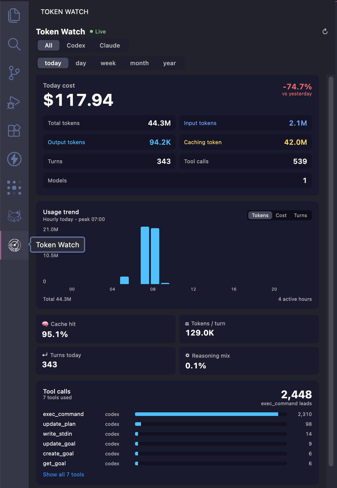

# Token Watch

A VS Code extension that tracks your AI coding token usage and cost across
Codex and Claude sessions, surfaced in a sidebar dashboard and the status bar.

It reads the JSONL session logs those tools already write to disk, aggregates
them locally into an embedded SQLite store (sql.js), and shows usage, cost, and
intensity metrics. Raw prompt/response content is never extracted or stored —
only token counts and structural metadata.



## Features

- Sidebar dashboard: daily series, per-variant breakdown, top models, session
  leaderboard, composition, and trend charts, filterable by source/period.
- Status bar item showing today's tokens and cost.
- Local pricing engine with bundled defaults and user overrides; unknown models
  fall back to a configurable `$fallback` rate and are flagged in the UI.
- Incremental ingestion: a background worker thread watches the log directories
  and only parses new bytes, with a full "Rescan Logs" command for a rebuild.
- Quality/freshness signals: malformed and oversized line counts, unmapped
  models, and last-ingest/most-recent-record timestamps.

## Commands

- `Token Watch: Open Panel` (`token-watch.openPanel`)
- `Token Watch: Rescan Logs` (`token-watch.rescan`) — wipes and rebuilds the store.

## Configuration

All settings live under the `tokenWatch.*` namespace (see the Settings UI):

- `sources.codex.enabled` / `sources.claude.enabled` and `*.path` overrides.
- `pricing.overrides` — per-model rate overrides merged over bundled defaults.
- `currency.secondary` / `currency.secondaryRate` — optional secondary display currency.
- `ingestion.watchDebounceMs`, `ingestion.maxLineBytes`, `ingestion.backfillMonths`
  (`0` = unlimited backfill).
- `analytics.anomalyMultiplier`, `analytics.contextFillWarnPct`.
- `statusBar.enabled`.

Pricing can also be edited in `pricing.config.jsonc` at the workspace root
(JSONC with comments). `$fallback` sets the rate for any model not listed.

## Architecture

```
token-watch/
├── src/
│   ├── extension.ts            # Activation: config, coordinator, sidebar, status bar, watcher
│   ├── SidebarProvider.ts      # Webview host ↔ worker message relay
│   ├── host/                   # IngestionCoordinator, FileWatcher, StatusBarController, config
│   ├── worker/                 # Worker thread: discovery, parsers, normalizer, pricing, store
│   │   ├── parsers/            # Codex + Claude JSONL streaming parsers
│   │   └── store/              # sql.js UsageStore, schema, queries
│   ├── shared/                 # Types + protocols shared across host/worker/webview
│   └── webview/                # React dashboard (zustand store, components)
├── esbuild.js                  # Bundler config
└── package.json                # Extension manifest
```

The host never parses logs directly: all parsing, pricing, and storage happen
in the worker thread, which never imports `vscode`. Queries return only
aggregated rows, never raw log content.

## Develop

```bash
npm install
npm run watch     # esbuild + tsc in watch mode
```

Press `F5` in VS Code to launch the Extension Development Host.

## Scripts

| Script | Purpose |
|--------|---------|
| `npm run compile` | Type-check, lint, and bundle once |
| `npm run watch` | Watch mode (esbuild + tsc) |
| `npm run package` | Production bundle |
| `npm run check-types` | Type-check only |
| `npm run lint` | Run ESLint |
| `npm test` | Run tests (integration + property suites) |

## Requirements

- VS Code `^1.90.0`
- Node.js 20+
