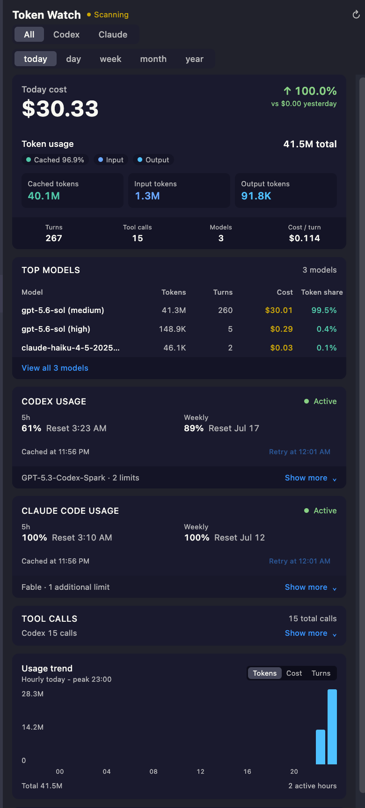
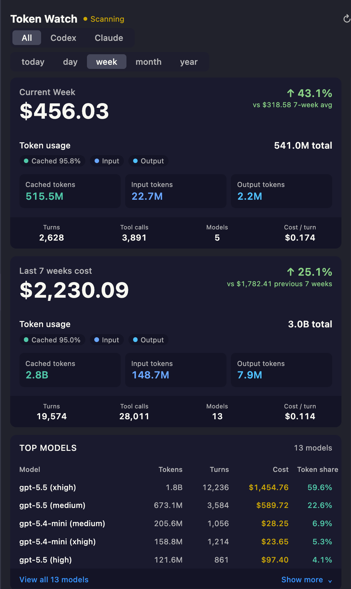
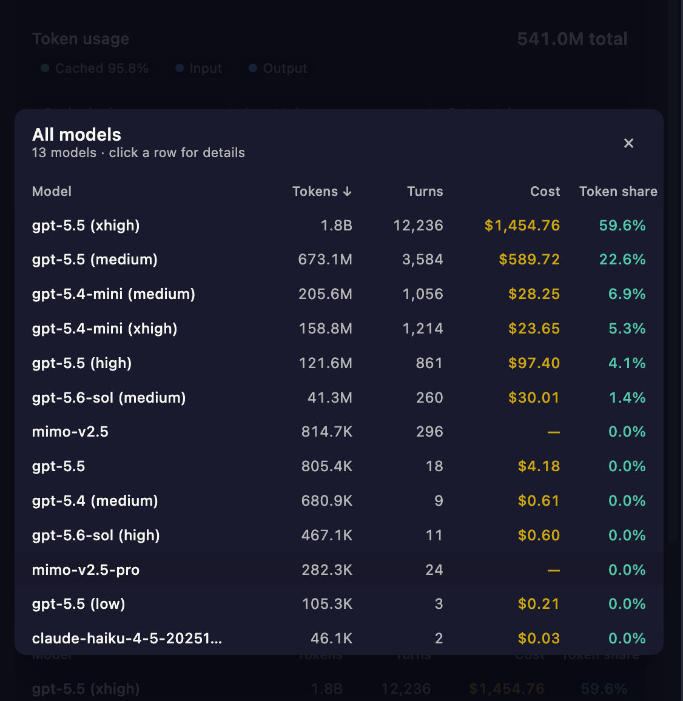

# Token Watch

A VS Code extension that tracks your AI coding token usage and cost across
Codex and Claude sessions, surfaced in a sidebar dashboard and the status bar.

It reads the JSONL session logs those tools already write to disk, aggregates
them locally into an embedded SQLite store (sql.js), and shows usage, cost, and
intensity metrics. Raw prompt/response content is never extracted or stored —
only token counts and structural metadata.

### What leaves your machine

Ingestion is entirely local. The subscription-quota panels are not: while the
sidebar is open or the status bar is enabled (both on by default), Token Watch
reads your existing Codex and Claude Code sign-in from disk and makes
authenticated requests to those providers' usage endpoints to show how much
quota you have left.

If the stored access token has expired, it performs the same OAuth refresh the
CLIs do and **writes the rotated tokens back** to `~/.codex/auth.json` or
`~/.claude/.credentials.json` (or the macOS Keychain). Writes are atomic, keep
the file's existing permissions, and are refused if the other tool rotated the
credentials first. Turn the panels off with `tokenWatch.statusBar.enabled` and
by closing the sidebar if you would rather it never touched them.

<p align="center">
  
  
  
</p>

## Features

- Sidebar dashboard: daily series, per-variant breakdown, top models, session
  leaderboard, composition, and trend charts, filterable by source/period.
- Status bar item showing today's tokens and cost.
- Local pricing engine with bundled defaults and user overrides; unknown models
  fall back to a bundled fallback rate and are flagged in the UI so you can add
  a real price for them.
- Incremental ingestion: a background worker thread watches the log directories
  and only parses new bytes, with a full "Rescan Logs" command for a rebuild.
- Quality/freshness signals: malformed and oversized line counts, unmapped
  models, and last-ingest/most-recent-record timestamps.

## Commands

- `Token Watch: Open Panel` (`token-watch.openPanel`)
- `Token Watch: Rescan Logs` (`token-watch.rescan`) — wipes and rebuilds the store.

## Configuration

All settings live under the `tokenWatch.*` namespace (see the Settings UI):

- `sources.codex.enabled` / `sources.claude.enabled` and `*.path` overrides.
- `pricing.overrides` — per-model rate overrides merged over bundled defaults.
- `currency.secondary` / `currency.secondaryRate` — optional secondary display currency.
- `ingestion.watchDebounceMs`, `ingestion.maxLineBytes`, `ingestion.backfillMonths`
  (`0` = unlimited backfill).
- `retention.rawRecordDays` — delete per-turn detail older than this many days
  (`0`, the default, keeps everything). Daily and per-session totals are kept
  for every day either way, so the dashboard history stays complete; a pruned
  day gives up its hourly drill-down, its tool-call detail, and the ability to
  reprice it. Worth setting: the database grows by roughly 10 MB a day under
  heavy use and nothing else bounds it. Turning it on marks the database so
  that a window still running a build from before retention will not open it —
  reload those windows. `Token Watch: Show Diagnostics` reports which days
  still have per-turn detail.
- `analytics.anomalyMultiplier`, `analytics.contextFillWarnPct`.
- `statusBar.enabled`.

Pricing can also be edited in `pricing.config.jsonc` inside the extension's
global storage directory (JSONC with comments). Only real model ids are
accepted — `$`-prefixed keys, including `$fallback`, are ignored, and the
bundled fallback rate is always used for unpriced models. Rates must be finite
and non-negative; anything else is dropped with a warning rather than producing
a negative or NaN cost. The file lives in global storage, not the workspace,
because the usage database is shared by every VS Code window — workspace-scoped
prices would make the same tokens cost different amounts depending on which
window ingested them. A file left in a workspace root is copied across once.

## Architecture

```
token-watch/
├── src/
│   ├── extension.ts            # Activation: config, coordinator, sidebar, status bar, watcher
│   ├── SidebarProvider.ts      # Webview host ↔ worker message relay
│   ├── host/                   # IngestionCoordinator, FileWatcher, StatusBarController,
│   │                           #   UsageStatusService, config, sidebar HTML
│   ├── worker/                 # Worker thread: discovery, parsers, normalizer, pricing, store
│   │   ├── parsers/            # Codex + Claude JSONL streaming parsers
│   │   └── store/              # sql.js UsageStore, schema, queries
│   ├── shared/                 # Types + protocols shared across host/worker/webview
│   └── webview/                # React dashboard (zustand store, components)
├── esbuild.js                  # Bundler config
└── package.json                # Extension manifest
```

The host never parses logs directly: all parsing, pricing, and storage happen
in the worker thread, which never imports `vscode`. Queries return only
aggregated rows, never raw log content.

Every window runs its own worker against the same global database, so exactly
one of them holds a writer lease and ingests; the rest serve the dashboard from
the writer's snapshot. The lease is advisory — the store's write lock and
file-identity check are the actual safety guarantee.

## Develop

```bash
npm install
npm run watch     # esbuild + tsc in watch mode
```

Press `F5` in VS Code to launch the Extension Development Host.

## Scripts

| Script | Purpose |
|--------|---------|
| `npm run compile` | Type-check, lint, and bundle once |
| `npm run watch` | Watch mode (esbuild + tsc) |
| `npm run package` | Production bundle |
| `npm run check-types` | Type-check only |
| `npm run lint` | Run ESLint |
| `npm run test:unit` | Pure + property suites under plain mocha (fast, no VS Code) |
| `npm run test:integration` | Extension Host suites via `@vscode/test-cli` |
| `npm test` | Both suites |
| `npm run package:vsix` | Build the VSIX and check it ships nothing it shouldn't |

Set `TOKEN_WATCH_VSCODE_VERSIONS=1.90.0,stable` to run the integration suites
against the minimum supported VS Code as well as the current stable build; CI
does this on Linux, macOS and Windows.

## Requirements

- VS Code `^1.90.0`
- Node.js 20+
